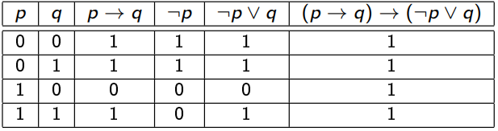
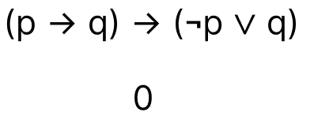
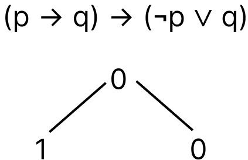
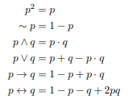

# Wartościowanie

`Tautologia` - zdanie zawsze prawdziwe bez względu na kombinacje wartości logicznych zdań składowych.

## Wartościowanie słowami 

| Znak | Wartość |
| ---- | ------- |
| a → b  | Jeśli a, to b |
| a ^ b  | i a, i b |
| a ∨ b  | abo a, abo b |
| a <=> b  | Jeśli a i tylko a, to b |
| ¬a  | nie a |

## Metody rachunku zdań

- zero-jedynkowa
- sprowadzenie do absurdu
- przekształcenia równoważne
- zamiana na arytmetykę

### Metoda zero-jedynkowa

Przykładowy wyraz: `(p → q) → (¬p ∨ q)`

Robimy tabelkę ze wszystkimi możliwymi wartościami zero-jedynkowymi dla wszystkich zmiennych (w naszym przypadku dla `p` i `q`, może być więcej).

Określamy rekurencyjnie wartość wejściową każdego logicznego elementu wyrazu w oparciu o wartości zmiennych.

We wszystkich przypadkach cały wyraz daje nam 1, więc wyraz jest tautologią.

### Metoda sprowadzenia do absurdu

Metoda sprowadzenia do absurdu polega na założeniu, że cały wyraz jest fałszem i udowodnieniu, że to nieprawda.

Są dwa przypadki w tej metodzie:

- Udowodniliśmy, że wyraz jest fałszem, czyli znaleźliśmy takie wartości zmiennych, które dają nam fałsz.
- Znaleźliśmy sprzeczność, to znaczy, że aby cały wyraz był fałszem, potrzebuje mieć takie wartości zmiennych w konkretnej sytuacji, ale ma inne.

Przykładowy wyraz: `(p → q) → (¬p ∨ q)`

Założymy, że wyraz jest fałszem, czyli zerem.

W naszym przypadku, aby cały wyraz był zerem, po lewej stronie musi być 1, a po prawej stronie 0, ponieważ to implikacja.

Po obu stronach implikacji są wyrazy. Każdy taki wyraz rozwiązujemy rekurencyjnie. Zrobimy prawą stronę, ponieważ po lewej stronie jest implikacja i nie będziemy mogli jednoznacznie powiedzieć o wartościach `p` i `q`, ponieważ są trzy przypadki, w których implikacja może być 1, i jest tylko jeden przypadek, w którym alternatywa może być 0.

> Alternatywa może być 0 tylko w jednym przypadku, kiedy po lewej i po prawej stronie są zera. (0 ∨ 0 = 0)

Po lewej stronie negacja `p`, a po prawej stronie po prostu `q`, więc rekurencyjnie wyznaczamy, że `p` ma być 1, a `q` ma być 0, aby cała prawa strona głównej implikacji była zerem.

Jednoznacznie wyznaczyliśmy te wartości. Nie ma innych przypadków, w których mielibyśmy 0, więc `p` i `q` po lewej stronie głównej implikacji muszą również zawierać 1 i 0 odpowiednio.

Ale implikacja nigdy nie daje nam 1, jeśli po lewej stronie jest 1, a po prawej 0. Więc mamy __sprzeczność__. 

    Znaleźliśmy sprzeczność, to znaczy, że aby cały wyraz był fałszem, potrzebuje mieć takie wartości zmiennych w konkretnej sytuacji, ale ma inne.

### Przekształcenia równoważne

W tej metodzie przekształcamy wyraz na tylko alternatywę i koniunkcję. Do tego używamy wzorów.

Dodatkowy wzór:

`p <=> q = (p → q) ∧ (q → p)`

> !!Uwaga!!

    ¬p ∨ p = 1 - zawsze

Przykładowy wyraz: `(p → q) → (¬p ∨ q)`

- Cały wielki wyraz możemy zastąpić na: `¬(p → q) ∨ (¬p ∨ q)` (_zamiana implikacji na alternatywę_)
- To samo zrobimy i z częścią `p → q`: `¬(¬p ∨ q) ∨ (¬p ∨ q)` (_zamiana implikacji na alternatywę_)
- Łączność alternatywy pozwala nam pozbyć się nawiasów w `(¬p ∨ q)` (negacja w `¬(¬p ∨ q)` nie pozwala nam tego zrobić w tej części): `¬(¬p ∨ q) ∨ ¬p ∨ q` (_łączność alternatywy_)
- Aby pozbyć się negacji w `¬(¬p ∨ q)`, wykorzystujemy `prawo de Morgana`: `(p ∧ ¬q) ∨ ¬p ∨ q` (_prawo de Morgana_)
- Aby pozbyć się nawiasów w `(p ∧ ¬q) ∨ ¬p ∨ q`, wykorzystujemy `rozdzielność koniunkcji` (jako mnożenie) (np. `q` pomnożymy na `(p ∧ ¬q)`): `((p ∨ q) ∧ (¬q ∨ q)) ∨ ¬p` (_rozdzielność koniunkcji_)
- Opuszczamy nawiasy: `(p ∨ q) ∨ ¬p` (_rozdzielność koniunkcji_)
- Przekształcamy wyraz tak, aby zrozumieć, czy może on mieć jedynkę: `(p ∨ ¬p) ∨ q` (_rozdzielność koniunkcji_)

Podsumowanie:

`(p ∨ ¬p)` - zawsze będzie jedynką, co daje możliwość stwierdzić, że `(p ∨ ¬p) ∨ q` też zawsze będzie jedynką, ponieważ alternatywa musi mieć tylko jeden argument równy 1, aby cały wyraz miał 1. Więc to jest tautologia.

#### Zamiana na arytmetykę

Przykładowy wyraz: `(p → q) → (¬p ∨ q)`

Ten wyraz można rozwiązać różnymi sposobami. Preferuję rozbić go na małe części, rozwiązać je, potem skombinować te małe części i powtarzać tak do końca.

Założymy, że `(p → q)` = `a`,
a `(¬p ∨ q)` = `b`.

    a) p → q = 1 - p + pq;
    b) ¬p ∨ q = (1 - p) ∨ q = (1 - p) + q - (1 - p) * q;
    ab) a → b = 1 - (1 - p + pq) + (1 - p + pq)(1 - p + pq) =
    = 1 - 1 + p - pq + (1 - p + pq - p + p^2 - (p^2)*q + pq - (p^2)*q + (p^2)*q + (p^2)*(q^2)) =
    = p - pq + 1 - p + pq - p + p - pq + pq - pq + pq + pq = 1

Otrzymaliśmy `1`, co znaczy, że jest to tautologia.