# Architektury komputerowe jako złożone układy cyfrowe

## Podstawy techniki cyfrowej

`HDL(hardware description language)` - abstrakcyjna specyfikacja projektu w odpowiednim języku opisu sprzętu 
`CAD(computer aided design)` - różnorodnych narzędzi komputerowego wspomagania projektowania.

# Wielowrotnik układu cyfrowego

`Wielowrotnik` (ang. multiport element)` - wielozaciskowy element układu elektrycznego, którego zaciski wyprowadzone na zewnątrz można pogrupować w pary zwane wrotami.

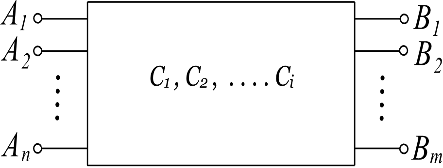

# Układy logiczne

`Układy logiczne` to dział techniki cyfrowe w której układy cyfrowe są konstruowane na poziomie bramek logicznych i przerzutników. Wszystkie układy cyfrowe dzielą się na dwie grupy

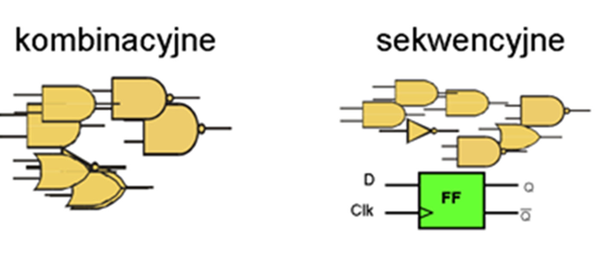

## Układy kombinacyjne

Stan wyjścia Y układu cyfrowego w danym momencie czasowym zależy ściśle od stanów jego wejść A,B,C.


## Układy sekwencyjne

Stan wyjść Q w danym momencie czasowym zależy od aktualnego stanu wejść P oraz stanów wcześniejszych zapamiętanych w przerzutnikach RS.
Moment czasowy wyznacza zegar doprowadzony do wejścia X. 
Najogólniej można powiedzieć że układy sekwencyjne to takie które mają doprowadzony zegar CLK.


## Liczenie binarne


    1 + 1 = 1

    A + A = A

    A * A = A

## Wzór Shannon

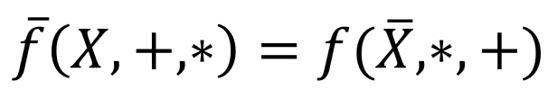

`Iloczyn n zmiennych` - jest wyrazem bądź `termem` iloczynowym n literałów.

`Iloczyn pełny` czyli iloczyn zawierający wszystkie literały jest `mintermem`.

`Suma n zmiennych` - jest wyrazem bądź `termem` sumacyjnym n literałów.

`Suma pełna` czyli suma zawierająca wszystkie literały jest `makstermem`.

---

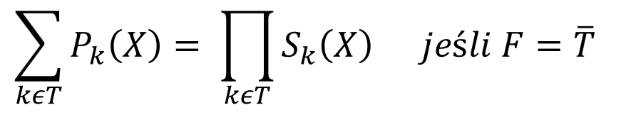

Między obydwoma zasadami obowiązuje zasada równoważności form: dla każdej kanonicznej formy sumacyjnej można określić równoważną kanoniczną formę iloczynową.

## Reguły obowiązujących w algebrze Boole'a

Reguła przemienności iloczynu i sumy logicznej

```
A + B = B + A
A * B = B * A
```

Reguła łączności działań

```
(A + B) + C = A + (B + C)
(A * B) * C = A * (B * C)
```

Reguła rozdzielności działań

```
A * (B + C) = A * B + A * C
```

Obowiązuje następująca kolejność operacji: 

- nawiasy
- negacja
- iloczyn
- suma

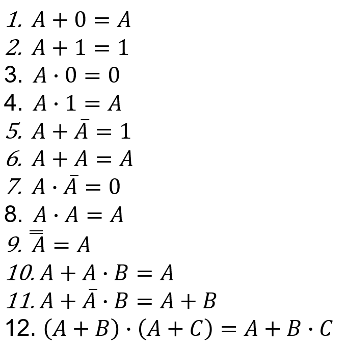

## Ważne prawa de Morgan’a pokazujące związki pomiędzy sumowaniem i mnożeniem logicznym

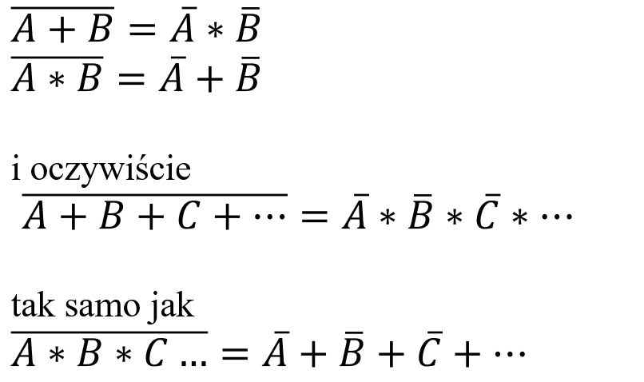

## Sygnał cyfrowy


Sygnały cyfrowe: a) okresowe i b) nieokresowe

## Kształt rzeczywistego sygnału cyfrowego 


Elementy charakterystyczne kształtu impulsu

## Podstawowe parametry układów cyfrowych

1. Szybkość działania układu cyfrowego
2. Moc rozpraszana w układzie
3. Odporność na zakłócenia
4. Obciążalność układu

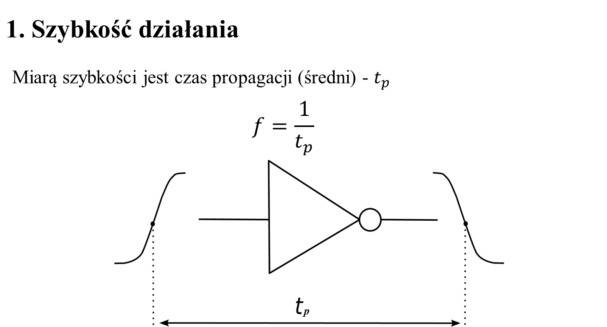

## 2. Moc rozpraszana w układzie

Moc rozpraszana w układzie dla prądu stałego jest liczona wg. prostej formuły:

𝑃_𝐷=𝑈_𝑐𝑐∙ 𝑖_𝑐𝑐

Dla prądu przemiennego w czasie formuła jest następująca:

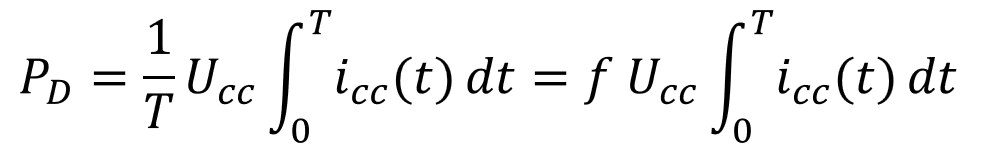

gdzie: 𝑖_𝑐𝑐 (𝑡) jest prądem czerpanym ze źródła zasilania w ciągu okresu T

## 3. Odporność na zakłócenia

Generalnie zakłócenia ingerujące w układ bez względu skąd pochodzą dzielimy na dwie grupy: 

- zakłócenia statyczne
- zakłócenia dynamiczne

Podział jest dokonywany ze względu na czas trwania impulsów zakłócających. Różnicą jest granica będąca średnim czasem propagacji sygnału przez funktor logiczny czyli bramkę.

- Zakłócenia statyczne to takie których czas trwania jest mniejszy od czasu propagacji sygnału przez bramkę
-Zakłócenia dynamiczne to takie gdzie relacja pomiędzy czasami jest akurat odwrotna

## 4. Obciążalność układu

Obciążalność wyjściowa układu wyrażona n ilością układów tej samej serii/rodziny jaka może być dołączona do wyjścia tego układu:

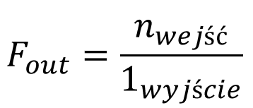

Bardzo często parametr ten jest nazywany Fenautem

## Podstawowe funktory logiczne / bramki:

Negacja - NOT, NIE - Inverter, negator
𝒀=~𝑨

Symbole według trzech standardów. Najpopularniejszy standard to ANSI

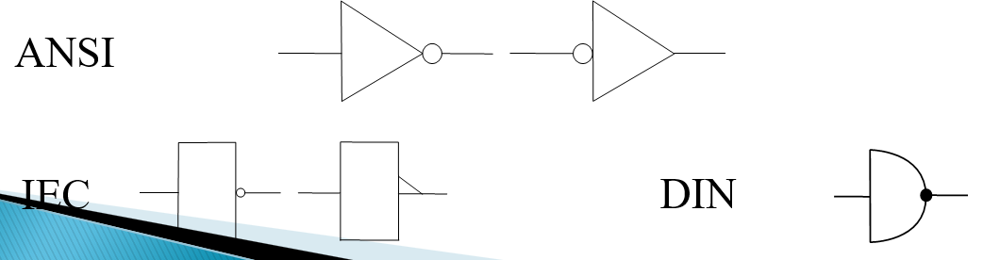

## Bufor

W tym miejscu trzeba jeszcze wspomnieć o funktorze będącym prostym buforem czyli układowym separatorem sygnału na wyjściu układu od jego wejścia.
Jest to układ który działa według następującej tabeli prawdy:


Ponieważ symbol jest taki sam jak w układach analogowych wzmacniacza sygnału trzeba tutaj pokazać istotną różnicę istniejącą między obydwoma układami.
Wzmacniacz jest układem liniowym a bufor nieliniowym.
Wynika to z różnych charakterystyk tych dwóch elementów czyli zależności 𝑈_𝑤𝑦  𝑜𝑑  𝑈_𝑤𝑒. Przedstawiają to dwa rysunki poniżej:


---

Suma logiczna  -  OR, LUB
               Y=A+B

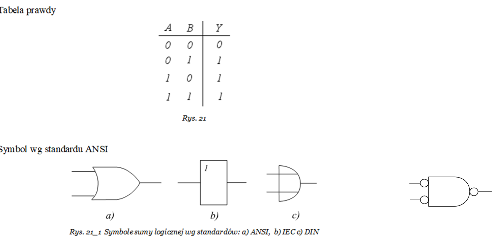

---

Suma logiczna zanegowana (Negacja sumy logicznej) NOR, LUB-NIE
𝒀=(𝑨+𝑩) ̅

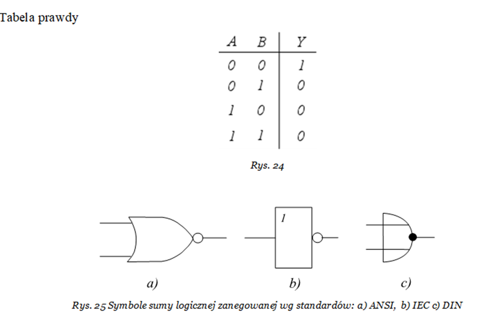

---

Iloczyn logiczny  - AND,  I
𝒀=𝑨⋅𝑩

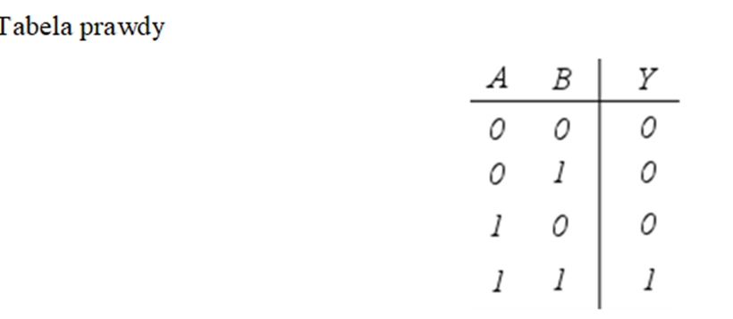

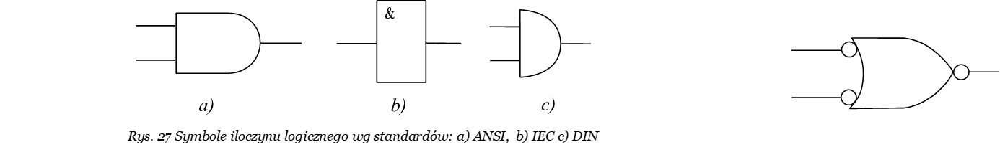

Iloczyn logiczny zanegowany (Negacja iloczynu logicznego)  -  NAND,  I-NIE

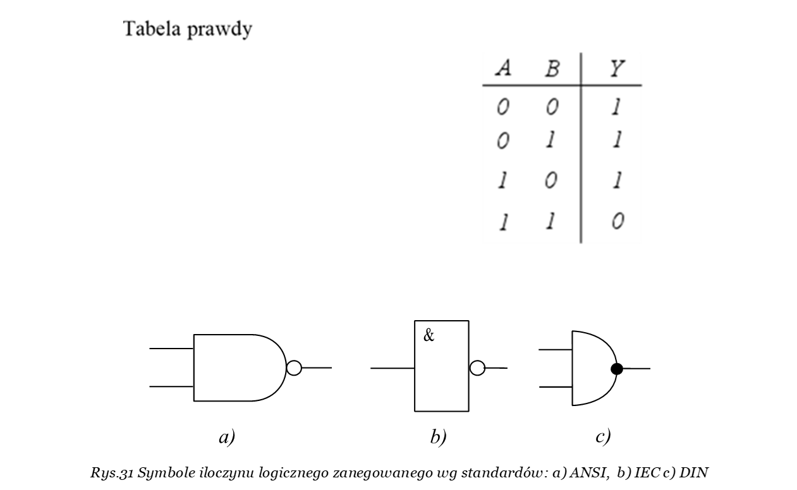

Suma modulo – XOR, EXCLUSIVE-OR, WYŁACZNIE-LUB
𝒀=𝑨⊕𝑩

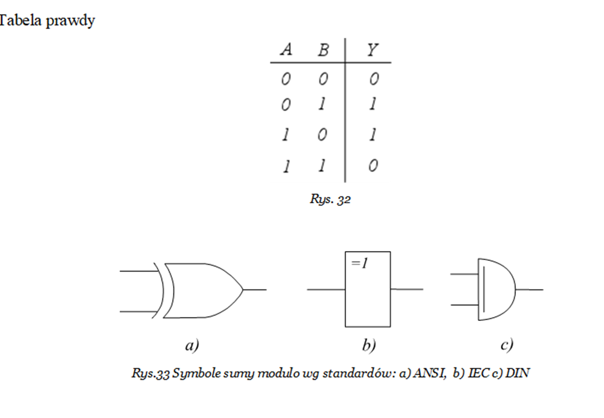