# Architektury komputerowe jako złożone układy cyfrowe

## Bramki logiczne

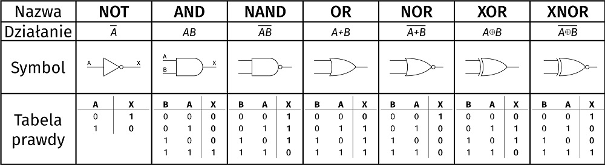

## Ważne prawa de Morgan'a pokazujące związki pomiędzy sumowaniem i mnożeniem logicznym

- ~(A + B) = ~A \* ~B
- ~(A + B + C + ...) = ~A \* ~B \* ~C \* ...
- ~(A \* B) = ~A + ~B
- ~(A \* B \* C \* ...) = ~A + ~B + ~C + ...

## Podstawy techniki cyfrowej

`HDL(hardware description language)` - abstrakcyjna specyfikacja projektu w odpowiednim języku opisu sprzętu
`CAD(computer aided design)` - różnorodnych narzędzi komputerowego wspomagania projektowania.

# Wielowrotnik układu cyfrowego

`Wielowrotnik` (ang. multiport element)` - wielozaciskowy element układu elektrycznego, którego zaciski wyprowadzone na zewnątrz można pogrupować w pary zwane wrotami.

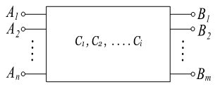

# Układy logiczne

`Układy logiczne` to dział techniki cyfrowe w której układy cyfrowe są konstruowane na poziomie bramek logicznych i przerzutników. Wszystkie układy cyfrowe dzielą się na dwie grupy

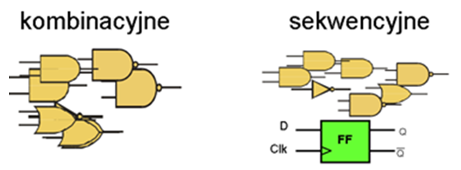

## Układy kombinacyjne

Stan wyjścia Y układu cyfrowego w danym momencie czasowym zależy ściśle od stanów jego wejść A,B,C.

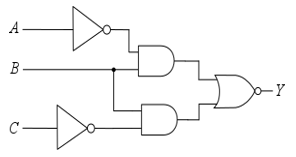

## Układy sekwencyjne

Stan wyjść Q w danym momencie czasowym zależy od aktualnego stanu wejść P oraz stanów wcześniejszych zapamiętanych w przerzutnikach RS.
Moment czasowy wyznacza zegar doprowadzony do wejścia X.
Najogólniej można powiedzieć że układy sekwencyjne to takie które mają doprowadzony zegar CLK.

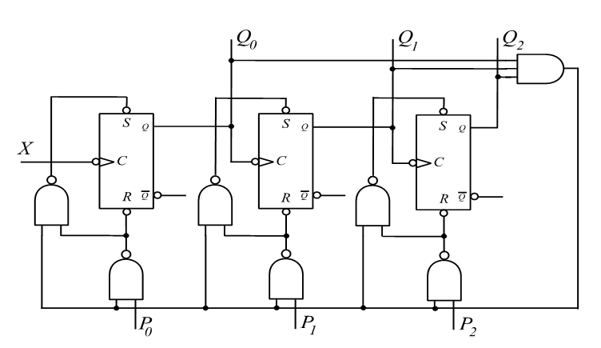

## Liczenie binarne

Kazdą liczbę całkowitą można przedstawić w postaci kodu naturalnego jako słowo postaci:

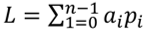

gdzie `a` jest jest znakiem kodu, `p` podstawą kodu

Liczba binarna zostanie więc przedstawiona jako:  
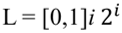

Czyli liczba dziesiętna np. 100 będzie przedstawiona binarnie jako:

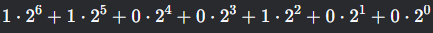

## Zasady

    1 + 1 = 1

    A + A = A

    A * A = A

## Wzór Shannon

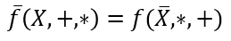

`Iloczyn n zmiennych` - jest wyrazem bądź `termem` iloczynowym `n` literałów.

`Iloczyn pełny` czyli iloczyn zawierający wszystkie literały jest `mintermem`.

`Suma n zmiennych` - jest wyrazem bądź `termem` sumacyjnym n literałów.

`Suma pełna` czyli suma zawierająca wszystkie literały jest `makstermem`.

---

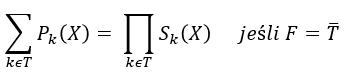

Między obydwoma zasadami obowiązuje zasada równoważności form: dla każdej kanonicznej formy sumacyjnej można określić równoważną kanoniczną formę iloczynową.

## Reguły obowiązujących w algebrze Boole'a

Reguła przemienności iloczynu i sumy logicznej

```
A + B = B + A
A * B = B * A
```

Reguła łączności działań

```
(A + B) + C = A + (B + C)
(A * B) * C = A * (B * C)
```

Reguła rozdzielności działań

```
A * (B + C) = A * B + A * C
```

Obowiązuje następująca kolejność operacji:

- nawiasy
- negacja
- iloczyn
- suma

---

- 𝐴 + 0 = 𝐴
- 𝐴 + 1 = 1
- 𝐴 ∙ 0 = 0
- 𝐴 ∙ 1 = 𝐴
- 𝐴 + ~𝐴 = 1
- 𝐴 + 𝐴 = 𝐴
- 𝐴 ∙ ~𝐴 =0
- 𝐴 ∙ 𝐴 = 𝐴
- ~~𝐴 = 𝐴
- 𝐴 + 𝐴 ∙ 𝐵 = 𝐴
- 𝐴 + ~𝐴 ∙ 𝐵 = 𝐴 + 𝐵
- (𝐴 + 𝐵) ∙ (𝐴 + 𝐶) = 𝐴 + 𝐵 ∙ 𝐶

## Sygnał cyfrowy

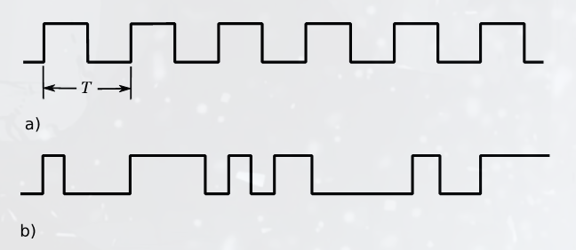

Sygnały cyfrowe: a) okresowe i b) nieokresowe

## Kształt rzeczywistego sygnału cyfrowego

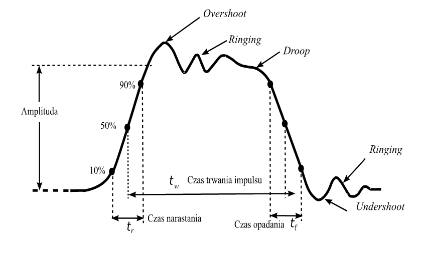

Elementy charakterystyczne kształtu impulsu

## Podstawowe parametry układów cyfrowych

## 1. Szybkość działania układu cyfrowego

Miarą szybkości jest czas propagacji (średni) - Tp.

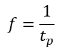

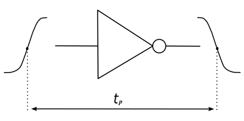

## 2. Moc rozpraszana w układzie

Moc rozpraszana w układzie dla prądu stałego jest liczona wg. prostej formuły:

𝑃*𝐷=𝑈*𝑐𝑐∙ 𝑖_𝑐𝑐

Dla prądu przemiennego w czasie formuła jest następująca:

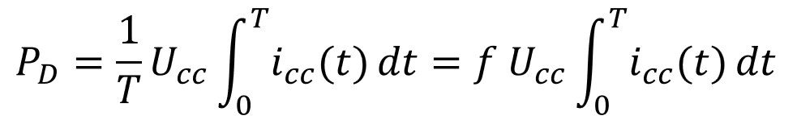

gdzie: 𝑖_𝑐𝑐 (𝑡) jest prądem czerpanym ze źródła zasilania w ciągu okresu T

## 3. Odporność na zakłócenia

Generalnie zakłócenia ingerujące w układ bez względu skąd pochodzą dzielimy na dwie grupy:

- zakłócenia statyczne
- zakłócenia dynamiczne

Podział jest dokonywany ze względu na czas trwania impulsów zakłócających. Różnicą jest granica będąca średnim czasem propagacji sygnału przez funktor logiczny czyli bramkę.

- Zakłócenia statyczne to takie których czas trwania jest mniejszy od czasu propagacji sygnału przez bramkę.
- Zakłócenia dynamiczne to takie gdzie relacja pomiędzy czasami jest akurat odwrotna.

## 4. Obciążalność układu

Obciążalność wyjściowa układu wyrażona n ilością układów tej samej serii/rodziny jaka może być dołączona do wyjścia tego układu:

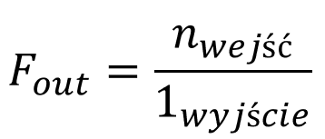

Bardzo często parametr ten jest nazywany Fenautem

## Podstawowe funktory logiczne / bramki:

Symbole według trzech standardów. Najpopularniejszy standard to ANSI

## Bufor

W tym miejscu trzeba jeszcze wspomnieć o funktorze będącym prostym buforem czyli układowym separatorem sygnału na wyjściu układu od jego wejścia.
Jest to układ który działa według następującej tabeli prawdy:

| A   | Y   |
| --- | --- |
| 0   | 0   |
| 1   | 1   |

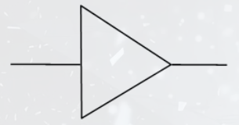

Ponieważ symbol jest taki sam jak w układach analogowych wzmacniacza sygnału trzeba tutaj pokazać istotną różnicę istniejącą między obydwoma układami.
Wzmacniacz jest układem liniowym a bufor nieliniowym.
Wynika to z różnych charakterystyk tych dwóch elementów czyli zależności 𝑈*𝑤𝑦 𝑜𝑑 𝑈*𝑤𝑒. Przedstawiają to dwa rysunki poniżej:

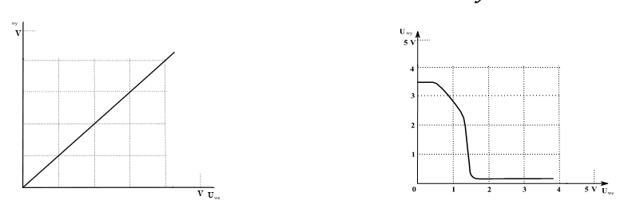

---

Suma logiczna - OR, LUB `Y = A  + B`

| A   | B   | Y   |
| --- | --- | --- |
| 0   | 0   | 0   |
| 0   | 1   | 1   |
| 1   | 0   | 1   |
| 1   | 1   | 1   |

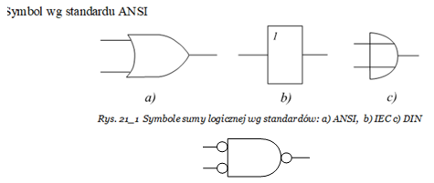

---

Negacja - NOT, NIE - Inverter, negator 𝒀=~𝑨

| A   | Y   |
| --- | --- |
| 0   | 1   |
| 1   | 0   |

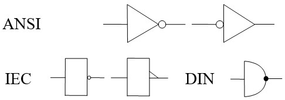

Symbole według trzech standardów. Najpopularniejszy standard to ANSI.

---

Suma logiczna zanegowana (Negacja sumy logicznej) NOR, LUB-NIE 𝒀=~(𝑨 + 𝑩)

| A   | B   | Y   |
| --- | --- | --- |
| 0   | 0   | 1   |
| 0   | 1   | 0   |
| 1   | 0   | 0   |
| 1   | 1   | 0   |

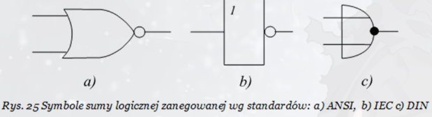

---

Iloczyn logiczny - AND, I 𝒀=𝑨⋅𝑩

| A   | B   | Y   |
| --- | --- | --- |
| 0   | 0   | 0   |
| 0   | 1   | 0   |
| 1   | 0   | 0   |
| 1   | 1   | 1   |

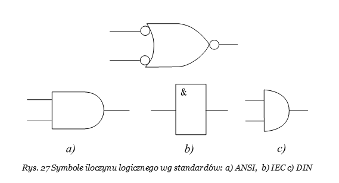

---

Iloczyn logiczny zanegowany (Negacja iloczynu logicznego) - NAND, I-NIE

| A   | B   | Y   |
| --- | --- | --- |
| 0   | 0   | 1   |
| 0   | 1   | 1   |
| 1   | 0   | 1   |
| 1   | 1   | 0   |

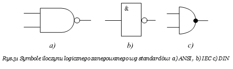

---

Suma modulo - XOR, EXCLUSIVE-OR, WYŁACZNIE-LUB 𝒀=𝑨⊕𝑩

| A   | B   | Y   |
| --- | --- | --- |
| 0   | 0   | 0   |
| 0   | 1   | 1   |
| 1   | 0   | 1   |
| 1   | 1   | 0   |

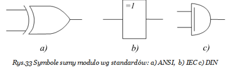

## Funkcja mieszana składająca się z iloczynów oraz sum trzech zmiennych ABC

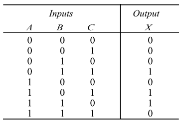

1. `SOP (Sum of Products)` - sumy iloczynów, to przypadki, gdy na wyjściu jest **1**.

   - Funkcja przedstawiona na zerach i jedynkach

     X = (0 _ 1 _ 1) + (1 _ 0 _ 1) + (1 _ 1 _ 0)

   - Funkcja przedstawiona na symbolach zmiennych

     X = (~A _ B _ C) + (A _ ~B _ C) + (A _ B _ ~C)

2. `POS (Products of Sum)` - iloczyn sum, gdy na wyjściu jest **0**.

   - Funkcja przedstawiona na zerach i jedynkach

     X = (0 + 0 + 0) _ (0 + 0 + ~1) _ (0 + ~1 + ~1) _ (~1 + 0 + 0) _ (~1 + ~1 + ~1)

   - Funkcja przedstawiona na symbolach zmiennych

     X = (A + B + C) _ (A + B + ~C) _ (A + ~B + ~C) _ (~A + B + C) _ (~A + ~B + ~C)

# Przykład zastąpienia schematu prostszym układem

Powiedzmy że mamy następujący schemat i powstał problem czy nie da się tego schematu zastąpić prostszym układem.

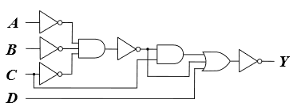

Matematyczny wygląd:

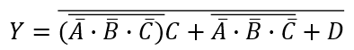

Można tą funkcję przekształcić do najprostszej postaci stosując reguły algebry Boole'a oraz przekształcenia de'Morgana:

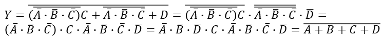

Nowy schemat:

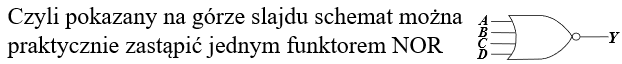

## Upraszczanie funkcji metodą tablic Karnaugh'a

1. Należy utworzyć tabelę podzielona na pola w ilości równej n zmiennych `w potędze 2`.
2. Czyli tabela dla czterech zmiennych ABCD będzie następująca

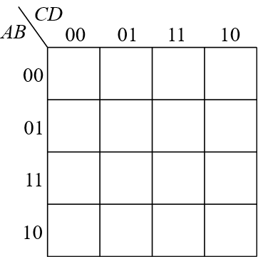

3. Ułożenie zmiennych może być dowolnie zadane, w naszym przypadku zrobiono to tak jak to jest zapisane w funkcji którą mamy uprościć czyli po kolei ABCD.

   Natomiast opis kodowy tabeli nie może być dowolny, czyli na przykład zapisany w kodzie binarnym. Zawsze musi to być kod Grey'a czyli taki jaki jest pokazany w przykładowej tablicy umieszczonej na poprzednim slajdzie.

4. Dla wypełnienia tabeli upraszczaną funkcję należy doprowadzić do `postaci pełnej` czyli `kanonicznej`.
5. Jeśli upraszczana funkcja jest typu `SOP` czyli `sumą iloczynów` to iloczyny należy wpisać w tabeli jako jedynki.
6. Należy zakreślić we wspólne obszary przylegające do siebie jedynki w ilości w tych obszarach dwa w potędze.
7. Można używać jedynki już wcześniej użyte.
8. Również tworzyć wspólne pola poprzez sklejenie tabeli wzdłuż krawędzi pionowej lub poziomej.
9. Również można sklejać tabelę równocześnie stykającą się po obydwu krawędziach.
10. Z zakreślonych pól należy dla utworzenia zredukowanego iloczynu pobrać te zmienne które się nie zmieniają i zsumować je dla uzyskania prawidłowego wyniku przekształceń.
11. Według tych samych zasad można uprościć wyrażenie typu `POS` czyli iloczyn sum

To co wcześniej zostało opisane jako upraszczanie określonego wyrażenie dalej zostanie pokazane na wybranym przykładzie.

Należy doprowadzić do najprostszej postaci następującą funkcję:

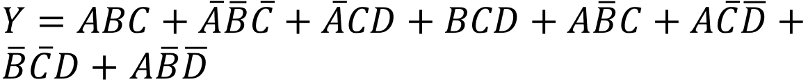

     𝑌 = 𝐴𝐵𝐶 + ~𝐴~𝐵~𝐶 + ~𝐴𝐶𝐷 + 𝐵𝐶𝐷 + 𝐴~𝐵𝐶 + 𝐴~𝐶~𝐷 + ~𝐵~𝐶𝐷 + 𝐴~𝐵~𝐷

---

Najpierw należy doprowadzić upraszczane wyrażenie do postaci kanonicznej (punkt 4 zaleceń)

Należy wykorzystać aksjomat, iż `1 = 𝐴 + ~𝐴`

Pierwszy iloczyn po uzupełnieniu będzie więc wyglądał następująco:

     𝑌 = 𝐴𝐵𝐶 * 1 + 𝐴𝐵𝐶(𝐷 + ~𝐷) = 𝐴𝐵𝐶𝐷 + 𝐴𝐵𝐶~𝐷

Całe wyrażenie zapisane w postaci kanonicznej będzie następujące:

     𝑌= 𝐴𝐵𝐶𝐷 + 𝐴𝐵𝐶~𝐷 + ~𝐴~𝐵~𝐶𝐷 + ~𝐴~𝐵~𝐶~𝐷 + ~𝐴𝐵𝐶𝐷 + ~𝐴~𝐵𝐶𝐷 + 𝑨𝑩𝑪𝑫 + ~𝑨𝑩𝑪𝑫 + 𝐴~𝐵𝐶𝐷 + 𝐴~𝐵𝐶~𝐷 + 𝐴𝐵~𝐶~𝐷 + 𝐴~𝐵~𝐶~𝐷 + 𝐴~𝐵~𝐶𝐷 + ~𝑨~𝑩~𝑪𝑫 + 𝑨~𝑩𝑪𝑫 + 𝑨~𝑩~𝑪~𝑫

Pogrubione iloczyny występują drugi raz i dlatego w ostatecznym zapisie zgodnie z aksjomatem `A + A = A` znikają.

Ostatecznie przykładowa funkcja zapisana w postaci kanonicznej będzie miała postać następującą:

     𝑌 = 𝐴𝐵𝐶𝐷 + 𝐴𝐵𝐶~𝐷 + ~𝐴~𝐵~𝐶𝐷 + ~𝐴~𝐵~𝐶~𝐷 + ~𝐴𝐵𝐶𝐷 + ~𝐴~𝐵𝐶𝐷 + 𝐴~𝐵𝐶𝐷 + 𝐴~𝐵𝐶~𝐷 + 𝐴𝐵~𝐶~𝐷 + 𝐴~𝐵~𝐶~𝐷 + 𝐴~𝐵~𝐶𝐷

| AB\CD | 00  | 01  | 11  | 10  |
| ----- | --- | --- | --- | --- |
| 00    |  1  |  1  |  1  |  0  |
| 01    |  0  |  0  |  1  |  0  |
| 11    |  1  |  0  |  1  |  1  |
| 10    |  1  |  1  |  1  |  1  |


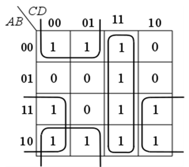
