# Wykład II

# Przerzutniki ()

Przerzutnikami są układy cyfrowe wystawiające na swoim wyjściu `Q` po wymuszeniu sygnałem `CLK` stany stabilne w ilości następującej:
- dwa stany stabilne dla przerzutnika `bistabilnego`
- jeden stan stabilny dla przerzutnika `monostabilnego`
- brak stanu stabilnego dla przerzutnika `astabilnego`

Ze względu na sposób wyzwalania rozróżnia się przerzutniki `asynchroniczne` oraz `synchroniczne`

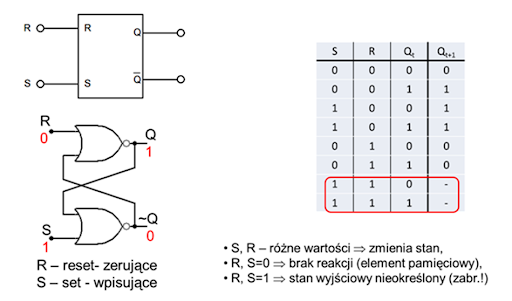

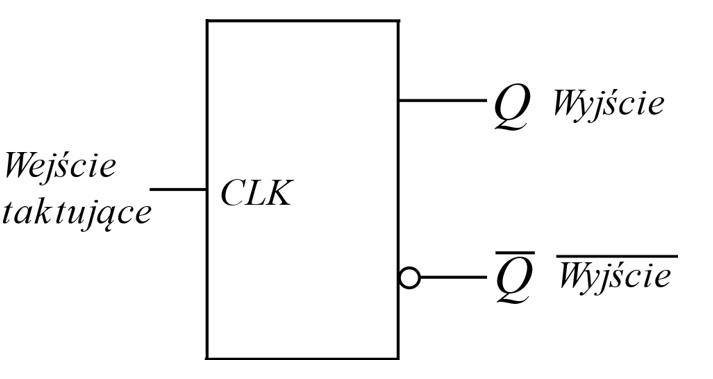

W grupie przerzutników bistabilnych definiowane są następujące typy:
- typ `RS`
- typ `D`
- typ `JK`

# Przerzutniki typu RS
## Przerzutniki asynchroniczne RS

Przerzutniki te są zbudowane z dwóch funktorów NOR lub NAND. Różnią się sposobem wyzwalania - poziomami sygnałów wyzwalających.

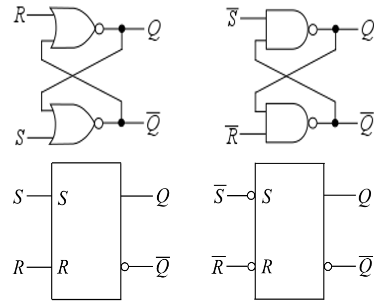

Poniżej zwrócono uwagę w działaniu przerzutnika RS zbudowanego z bramek NAND dla dwóch sytuacji:

1) Próba równoczesnego wyzwalania.
    Sygnałami niskiego poziomu na obu wejściach. Jest to sytuacja zwana bardzo trafnie po angielsku: Invalid condition.

    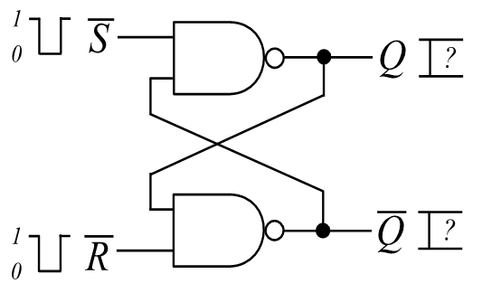

2)  ...

    

# Switch contact bounce
## Drgania styków - ich eliminacja

Właściwość wynikająca z drugiej sytuacji może być wykorzystana do eliminacji tzw. drgań zestyków. Jest to nie do końca słuszna nazwa tej sytuacji ponieważ przy przełączaniu zestyków one nie drgają mechanicznie tylko jest generowana sygnałowa fala stojąca. 
Czyli załączany styk może być źródłem wielu zanikających przełączeń.

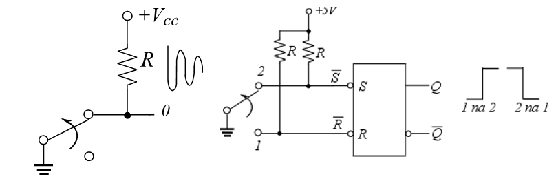

# Przerzutnik SR synchroniczny

Przerzutnik ten różni się od asynchronicznego tym, że przerzut na wyjściu następuje w chwili podania dodatkowego sygnału synchronizującego **EN** (`Enable`). Przerzut trwa od momentu pojawienia się zbocza sygnału synchronizującego i przez cały czas jego trwania.

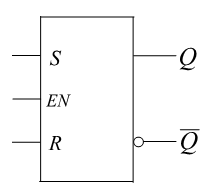

Wyzwalany poziomem

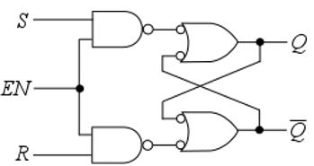

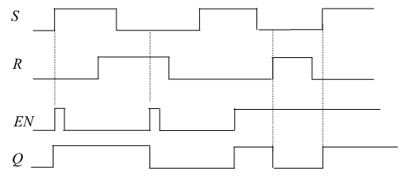

W tym przypadku/rozwiązaniu impuls wyzwalający został tak bardzo skrócony działaniem dodatkowego układu `DZI`, że praktycznie istnieje tylko zbocze wyzwalające. Ten impuls jest oznaczony `CLK` lub `C` (od `Clock`)

Wyzwalany zboczem

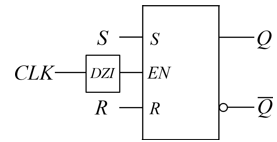

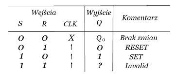

# Przerzutnik typu D

Tu dla obu przypadków komentarz taki sam jak w przypadku przerzutnika RS

Wyzwalany poziomem

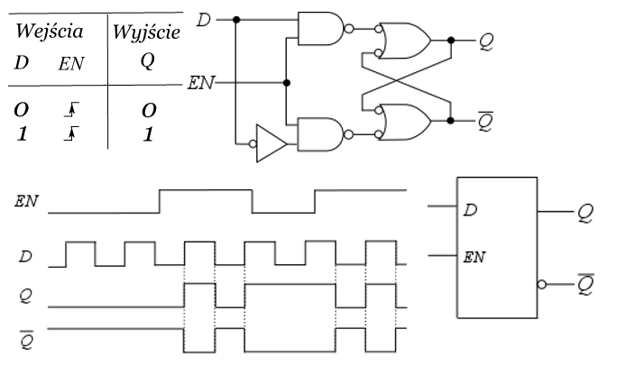

Są dwa sposoby rozwiązania układu `DZI`

1) Z pomocą układu różniczkującego

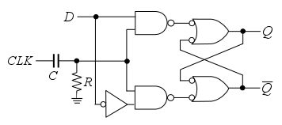

2) Z pomocą najprostszego przerzutnika   
    monostabilnego

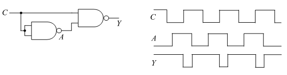

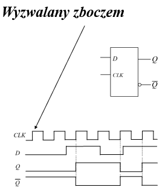

# Przerzutnik typu JK

Spróbujmy zwrócić uwagę na różnice w rozwiązaniu i działaniu pomiędzy przerzutnikami RS i JK

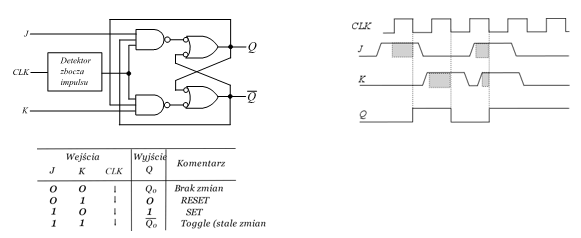

# Przerzutnik typu T

Jest to praktycznie przerzutnik JK ale skonfigurowany i pracujący w trybie Toggle

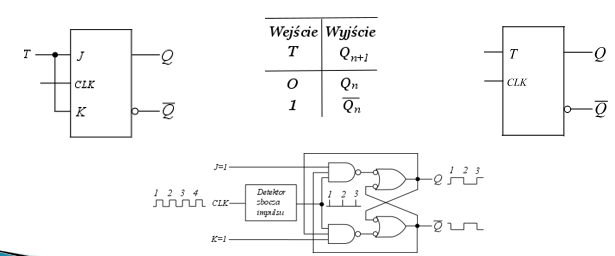

# Przerzutnik typu JK MS (dwuzboczowy)

`Przerzutnik synchroniczny JK-MS` (**M**aster-**S**lave) jest zbudowany z dwóch przerzutników `JK` połączonych kaskadowo. Jeden - nadrzędny (ang. **master**) - steruje pracą drugiego - podrzędnego (ang. **slave**) - bufora wyjściowego. 
Przy zboczu narastającym informacja jest wpisywana do przerzutnika master, zaś przy zboczu opadającym informacja pamiętana przez przerzutnik master jest przepisywana do przerzutnika wyjściowego slave i jest widoczna na wyjściu.

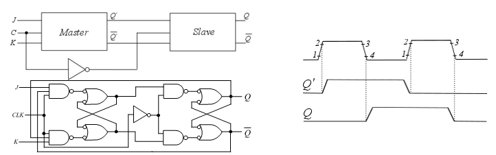

# Podsumowanie opisu przerzutników bistabilnych
# Przerzutniki typu RS  (latches)

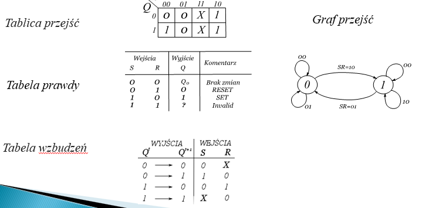

# Przerzutniki typu D  (latches)

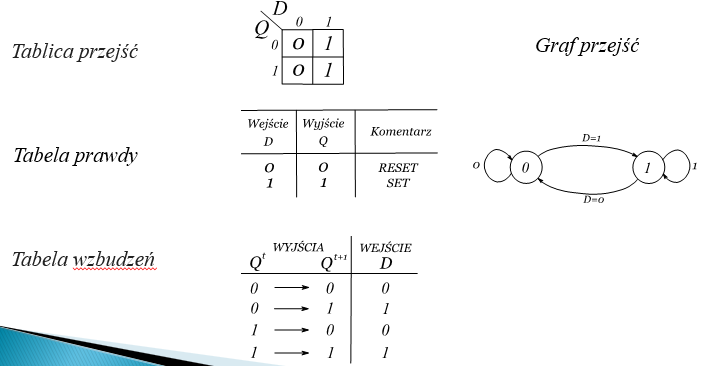

# Przerzutniki typu JK  (Flip Flop)

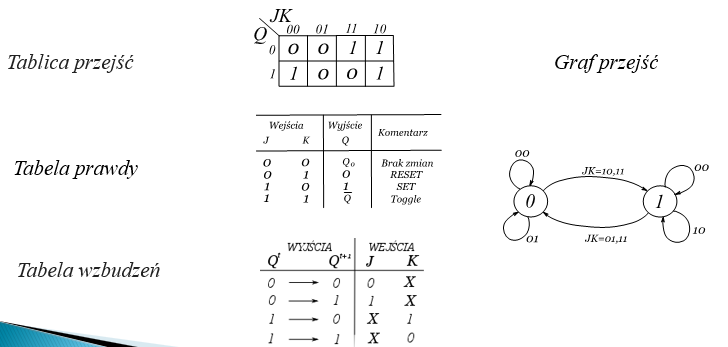

# Przerzutniki monostabilne

Kolejna grupa przerzutników to przerzutniki monostabilne zwane też multiwibratorami monostabilnymi, czyli takie, które na wyjściu generują pojedynczy impuls o określonym czasie trwania.

Na wyjściu zmieniające się poziomy startują z określonego poziomu trwania przechodzą na przeciwny i po tym zadanym czasie trwania wracają do pierwotnego.

Najprostszy przerzutnik monostabilny można uzyskać wykorzystując dwa funktory połączone w ten sposób, że jest wykorzystany czas propagacji jednego z nich do wygenerowania przez drugi impulsu o czasie trwania długości właśnie tego czasu propagacji.
Pokazuje to rysunek poniższy. Dla standardu TTL w którym czas propagacji przez pojedynczy funktor, w tym przypadku przez inwerter wynosi 10 ns taki właśnie impuls o takiej długości będzie generowany na wyjściu tego przerzutnika.

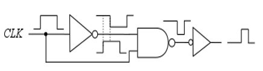

Zaprezentowany wcześniej przerzutnik posiada niestety sporą wadę polegającą na tym, że  nie można w nim generować mono-impulsu o zmiennym i dowolnym czasie trwania. 
Dopiero modyfikacja polegająca na tym, że o długości impulsu decyduje wbudowany układ różniczkujący daje takie możliwości. Zmiany długości trwania generowanego impulsu mogą być wtedy realizowane w szerokim zakresie zmian czasu trwania. 

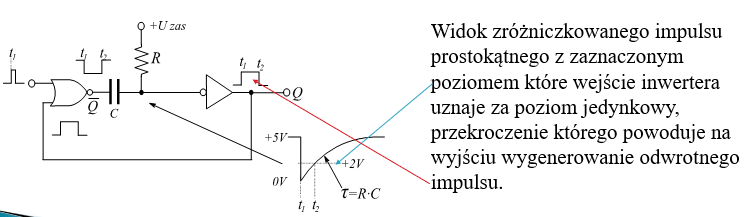

# Scalone przerzutniki monostabilne

Oczywiście nikt nie będzie składał takiego przerzutnika z pojedynczych elementów gdy można skorzystać ze scalonej konstrukcji. Tutaj w linii TTL istnieją dwa standardowe rozwiązania. Jedno to nie-retrygerowalny multivibrator monostabilny.
(Wprowadzam tutaj neologizm ale bardzo pasujący do sposobu działania tego przerzutnika.)
Oznacza to, że przerzutnik ten w czasie generowanego impulsu nie jest w stanie zmienić poziomu na wyjściu nawet jeśli jest powtórnie wyzwalany.  

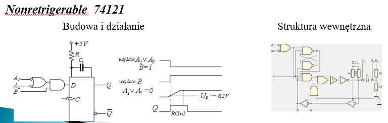

Drugie rozwiązanie to przerzutnik retrygerowalny. Oznacza to, że przerzutnik ten w czasie trwania generowanego impulsu może pod wpływem nowego wymuszenia (nowego trygeru) zmienić poziom na wyjściu. Rysunek poniżej pokazuje taką sytuacje przy powtórnym wymuszeniu w czasie generacji impulsu sygnałami B, A oraz R  

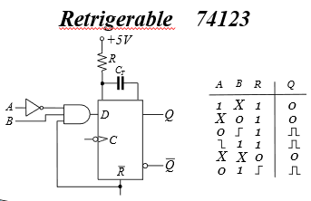

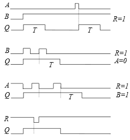

# Timer 555

Chce teraz przedstawić świetnie skonstruowany jeszcze w poprzednim wieku układ timera 555, który nadaje się do realizacji wielu aplikacji, a w naszym przypadku do wykonania przerzutnika monostabilnego.
Poniżej mamy przedstawiona barwnie strukturę wewnętrzna. 

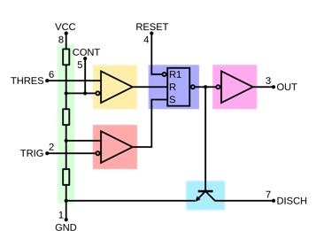

# Timer 555 jako multiwibrator monostabilny

Dla użytkowania układu 555 jako monostabilnego przerzutnika należy na zewnątrz dołączyć rezystor R oraz kondensator C które będą też pełniły rolę wyznaczania długości generowanego impulsu zgodnie z formułą T=1,1RC.

Działanie multiwibratora jest dwufazowe i przebiega następująco. W pierwszej fazie przez podanie na wejście TRIG dolnego komparatora zerowego impulsu wyzwalającego następuje ładowanie kondensatora ze stałą czasową 𝜏=𝑅𝐶 w czym nie przeszkadza zablokowany tranzystor T. Blokada tranzystora następuje poprzez podanie na jego bazę niskiego poziomu napięcia  z wyjścia 𝑄 ̅  przerzutnika RS. Z kolei przerzutnik ten jest zatrzaskiwany w taką pozycję sygnałem S (Set) podawanym z wyjścia dolnego komparatora.

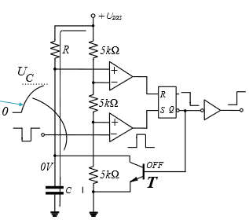

W drugiej fazie tranzystor T przełączony do stanu pełnego otwarcia powoduje prawie natychmiastowe rozładowanie kondensatora C. Stan pełnego otwarcia jest powodowany ustawieniem przerzutnika bistabilnego typu RS w stan wysokiego poziomu napięcia na wyjściu 𝑄 ̅. Te dwie zmiany wyjścia przerzutnika są widoczne na wyjściu timera 555 jako wygenerowany impuls o czasie trwania T=1,1RC. 
Następnie wejście TRIG oczekuje na przyjście kolejnego impulsu wyzwalającego o następującym kształcie 

# Przerzutniki astabilne - generatory impulsów prostokątnych

Kolejną grupą przerzutników do omówienia są przerzutniki bistabilne, czyli takie które na swoim wyjściu Q nie mają stanu stabilnego. Stan tego wyjścia stale się zmienia z wysokiego na niski i odwrotnie.

Są dwa sposoby realizacji takich przerzutników:
- Z wykorzystaniem kondensatora ładowanego i rozładowywanego 
   przemiennie
Z wykorzystaniem wzmacniaczy pracujących z dodatnim  
Sprzężeniem zwrotnym, dla uczynienia układu niestabilnym 

---
Zastosowany kondensator w trybie ładowania i rozładowania dla wzbudzania drgań

1. Używając Timera 555 skonfigurowanego tak jak pokazuje rysunek obok można doprowadzić go do stanu pracy jako przerzutnik astabilny. Kondensator C jest przemiennie ładowany ze stałą czasową 𝜏=(𝑅_1+𝑅_2)∙𝐶 i rozładowywany ze stałą 𝜏=𝑅_2∙𝐶 i układ zaczyna drgać trochę niesymetrycznie czasowo ze względu na różnice w długości stałych czasowych ładowania i rozładowania. 

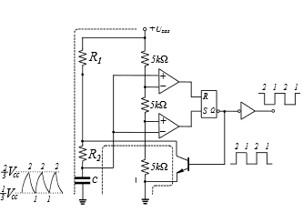

2. Innym sposobem jest użycie scalonych przerzutników monostabilnych typu 74121 zapętlonych w ten sposób, że wyjście generujące zbocze narastające wprowadzone na wejście B pierwszego przerzutnika powoduje powstanie na jego wyjściu pozytywnego impulsu o czasie trwania 𝜏=𝑅_1 𝐶_1. Z kolei zbocze opadające impulsu wprowadzonego na zwarte wejścia A drugiego przerzutnika powoduje wygenerowanie przez niego impulsu o długości 𝜏=𝑅_2 𝐶_2.

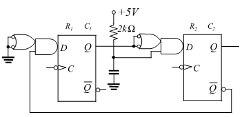

3. Można też w oparciu o zasadę wykorzystania ładowanego i rozładowywanego kondensatora i oddziaływania jego zmieniających się poziomów na wejścia komparatorów lub przerzutników co spowoduje powstanie drgań zrealizować bardzo prosty generator z udziałem przerzutnika Schmitta.

Minusem tego rozwiązania jest to, że wypełnienie fali prostokątnej nie jest symetryczne tzn. nie wynosi 1:1 a jest 1:3.

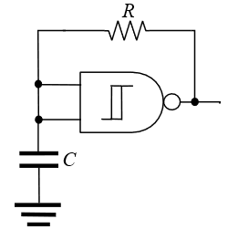

---

Zastosowanie wzmacniaczy z dodatnim sprzężeniem zwrotnym dla uczynienia układu niestabilnym 

Czy można używając układów cyfrowych w szczególności prostych bramek mówić o ich wykorzystaniu jako wzmacniaczy? Przecież bufor o którym mówiliśmy na wykładzie IX ma taki sam symbol jak wzmacniacz. W czym różnica?

Wzmacniacz jest układem liniowym a bufor nieliniowym. W układzie liniowym można policzyć z nachylenia charakterystyki jego wzmocnienie. W układzie nieliniowym nie da się tego zrobić nawet w trybie ekstrapolacji.

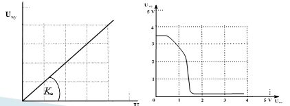

Co w takim razie należy i można zrobić?
Jeśli wzmacniacz opaszemy sprzężeniem zwrotnym i będzie to ujemne sprzężenie zwrotne to może ono poprawić właściwości wzmacniacza. W naszym przypadku może to być poprawa jego charakterystyki. Co może zatem oznaczać poprawa charakterystyki inwertera, nic innego jak swoista linearyzacje tej charakterystyki.

Jak to należy zrobić i jak będzie wyglądała zlinearyzowana charakterystyka inwertera pokazuje rysunek obok

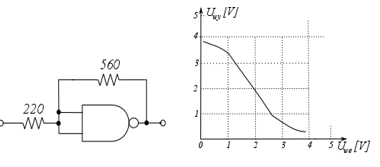