# Sieci komputerowe

# Ethernet network cables in LAN

> Link: [Video tutorial](https://www.youtube.com/watch?v=_NX99ad2FUA&t=82s&ab_channel=PowerCertAnimatedVideos)

Cables that can be found connected to your computer, router.

There are two types of such cables:

1) `UTP` [unshielded twisted pair] - common type of cable that is used today.

    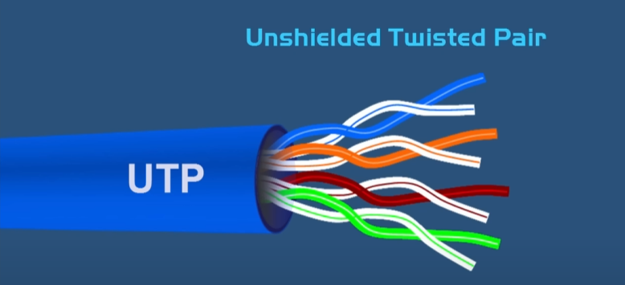

It consists of 4 pairs of colored-coded wires twisted around each other.

The wire are twisted to prevent electromagnetic interference.

2) `STP` [shielded twisted pair] - it is much the same thing as `UTP`, but it has a `foil shield` that covers the wires.

    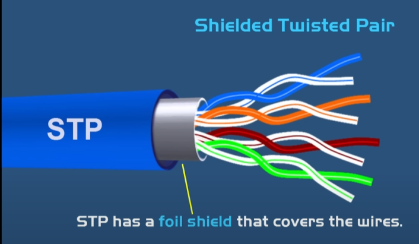

The foil shield adds a layer of protection against electromagnetic interference leaking into and out of the cables.

## The wire order in RJ45 connector.

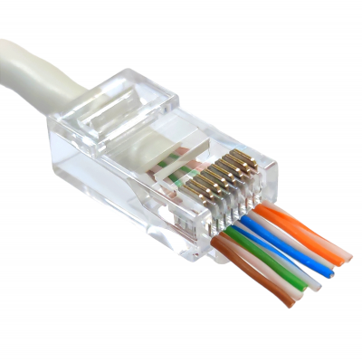

The wire order is very important and that order will be different depending upon purpose of the cables.

There are two standards of twisted pair cable: `T568A` & `T568A` - they are the same, just with different wire order.

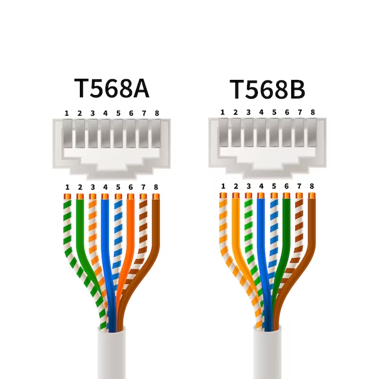

The most common types of twisted pair cables that are used today a LAN:

1) `Straight(patch) cable` - when both ends of a cable are wired using __the same__ standard. For example: both ends are `T568A`. The most common type of ethernet cable that's used on a LAN. They are used tto connect computer with hubs, switches, routers, or modems. `Connects dissimilar devices together`. .

    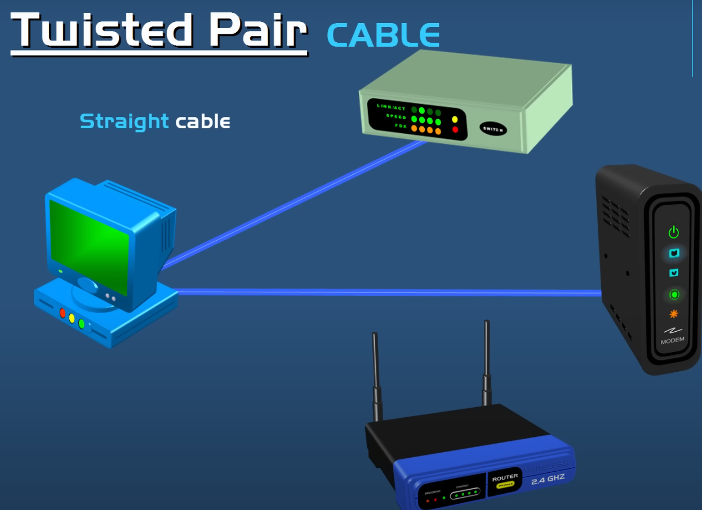

1) `Crossover cable` - when both ends of a cable are wired using two different standards. For example: one ends `T568A` and other one `T568B`. They are used to connect two similar devices together. For example: two computers

    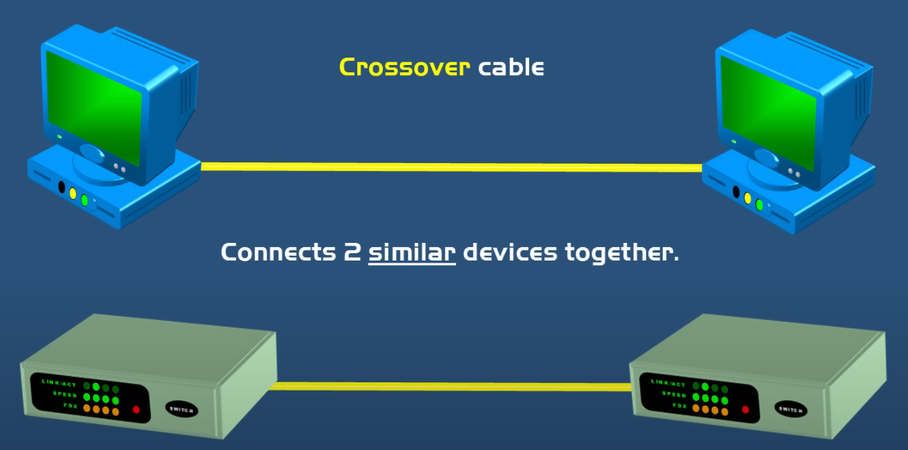

## Categories (CAT)

Those wires can be different categories and differ from each other by speed. Categories 4 and 5 are no longer standard, but from 5e cables are a standard.

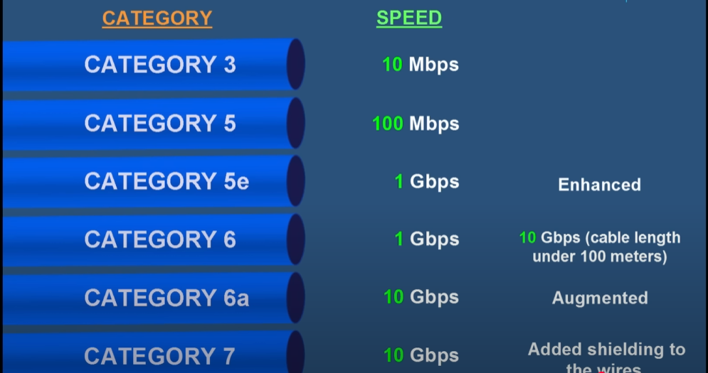

> There are also category 8, its speed 40Gbps.

# Światłowód

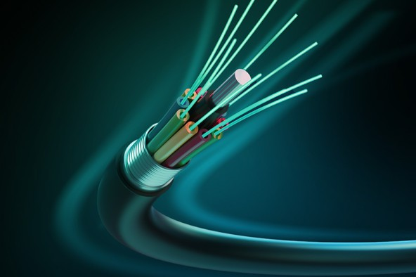

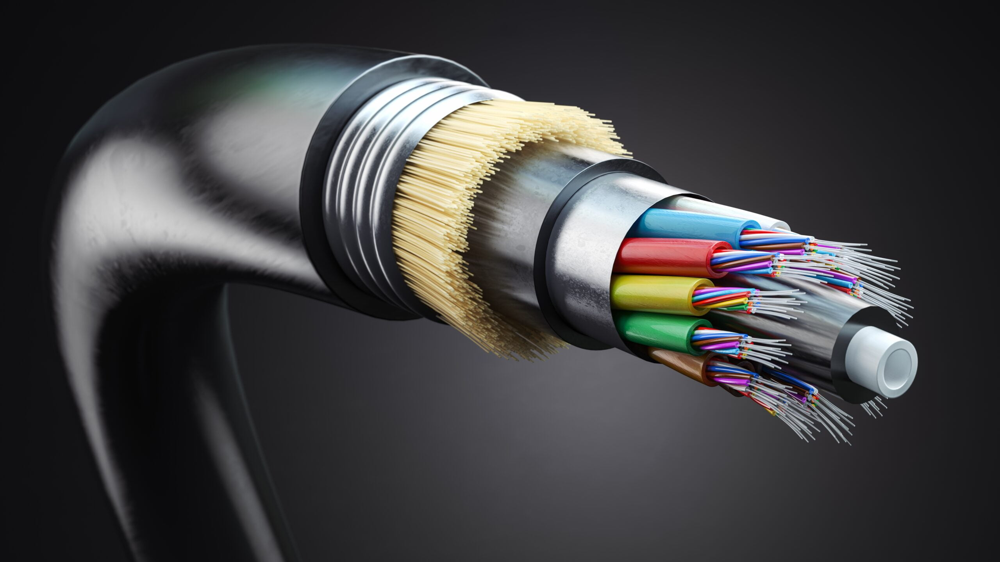

## 1. Światłowód - podstawowe informacje

Światłowód to przewód zbudowany z włókna szklanego lub plastikowego, w którym sygnał jest przesyłany w postaci światła. Jego główne zalety to:

- ✅ Bardzo wysoka prędkość transmisji danych

    Najczęściej w zakresie sieci światłowodowej oferowanych przez polskich operatorów są to następujące przedziały: 

    - prędkość pobierania do `300 Mb/s`, prędkość wysyłania do `50 Mb/s`
    - prędkość pobierania do `600 Mb/s`, prędkość wysyłania do `100 Mb/s`
    - prędkość pobierania do `1GB/s`, prędkość wysyłania do `300 Mb/s`

- ✅ Niski poziom zakłóceń elektromagnetycznych
- ✅ Duża odległość transmisji bez utraty jakości

    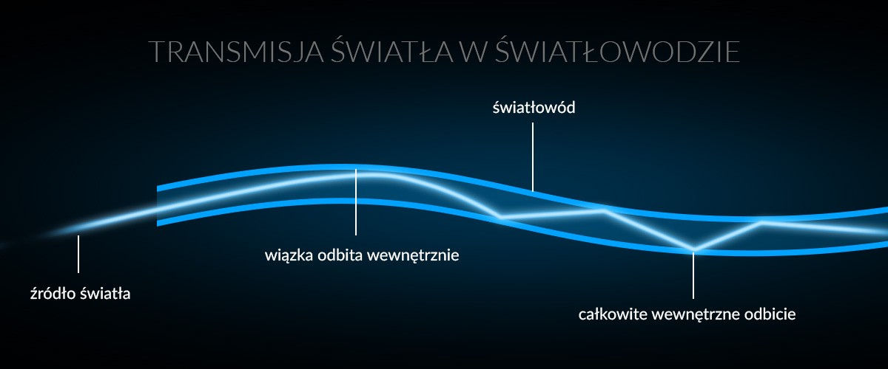

## 2. Rodzaje montażu światłowodu

- `W ziemi` - światłowód zakopany w specjalnych osłonach lub rurach ochronnych. Chroni go to przed warunkami atmosferycznymi i uszkodzeniami mechanicznymi

    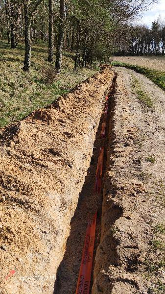

- `Napowietrzny` - zawieszony na słupach, podobnie jak kable elektryczne. Jest tańszy w instalacji, ale bardziej narażony na uszkodzenia (np. silny wiatr, burze)

    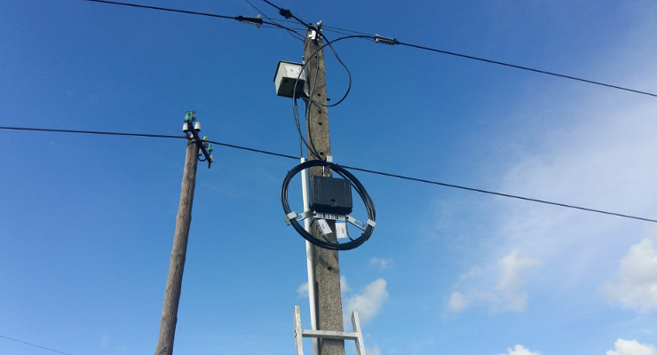

## 3. Zasięg i prędkość transmisji

Światłowody pozwalają na przesyłanie danych na ogromne odległości:

- 📌 `Zasięg`: od kilkunastu kilometrów do tysięcy kilometrów (np. światłowody podmorskie)
- 📌 `Prędkość transmisji`: od 1 Gb/s do nawet 1 Pb/s (petabit na sekundę) w nowoczesnych laboratoriach
- 📌 `Tłumienie sygnału`: standardowy światłowód traci około 0,2 dB/km przy długości fali 1550 nm

## 4. Budowa światłowodu

Światłowód składa się z kilku warstw:

- 🔹 `Rdzeń` - najważniejsza część, wykonana z czystego szkła lub plastiku, gdzie przemieszcza się światło
- 🔹 `Płaszcz optyczny` - warstwa odbijająca światło do rdzenia (zapewnia efekt całkowitego wewnętrznego odbicia)
- 🔹 `Osłona ochronna` - chroni światłowód przed uszkodzeniami mechanicznymi i wilgocią

    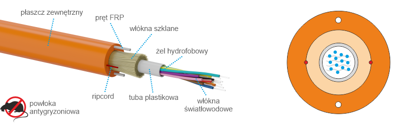

    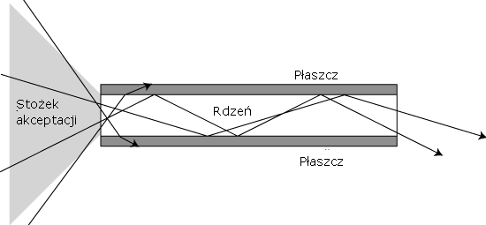

    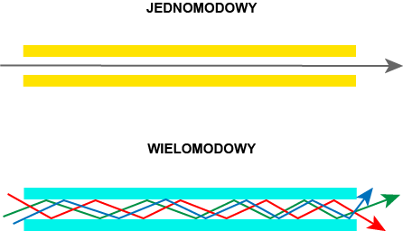

## 5. Rodzaje światłowodów

- 🔸 Jednomodowy (SM - Single Mode)
    - ✔ Bardzo mała średnica rdzenia (ok. 9 µm)
    - ✔ Transmisja na bardzo duże odległości (ponad 100 km)
    - ✔ Wysoka przepustowość i mniejsze tłumienie

    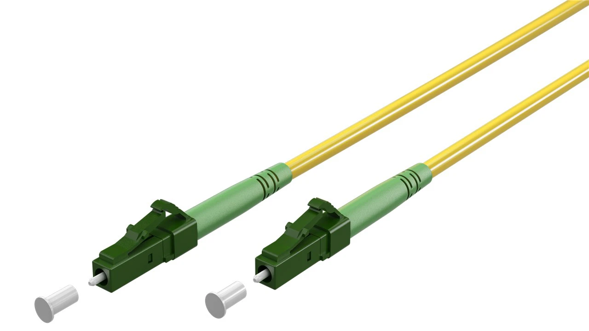

- 🔸 Wielomodowy (MM - Multi Mode)
    - ✔ Większa średnica rdzenia (50-62,5 µm)
    - ✔ Krótszy zasięg (kilka km)
    - ✔ Tańszy w produkcji i instalacji

    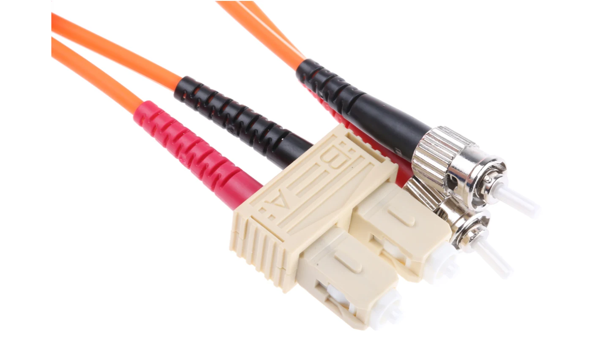

## 6. Światłowody oceaniczne

- 🔵 Podmorskie kable światłowodowe łączą kontynenty, zapewniając globalny dostęp do Internetu.
- 🔵 Są one układane na dnie oceanicznym przez specjalistyczne statki.
- 🔵 Długość tych kabli może wynosić nawet 40 000 km (np. kabel SEA-ME-WE 3).
- 🔵 Mają dodatkowe osłony przed ciśnieniem wody i uszkodzeniami mechanicznymi.

    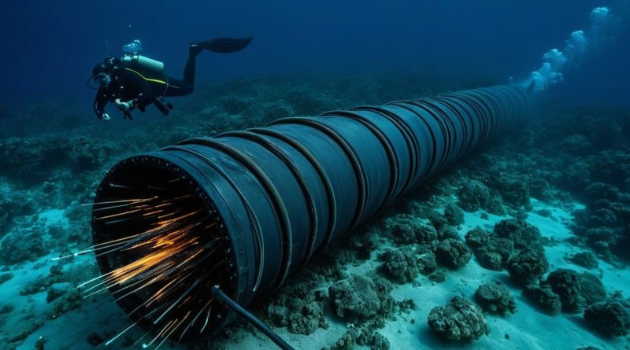

## 7. Zabezpieczenia światłowodu w ziemi

Światłowody zakopane w gruncie muszą być zabezpieczone przed:

- 🐀 `Gryzoniami` - stosuje się dodatkowe metalowe osłony lub specjalne powłoki chemiczne odstraszające zwierzęta.
- 🚜 `Uszkodzeniami mechanicznymi` - światłowody często umieszcza się w ochronnych rurach PCV.
- 💧 `Wilgocią` - stosuje się żele hydrofobowe, które zapobiegają dostaniu się wody do rdzenia kabla.

    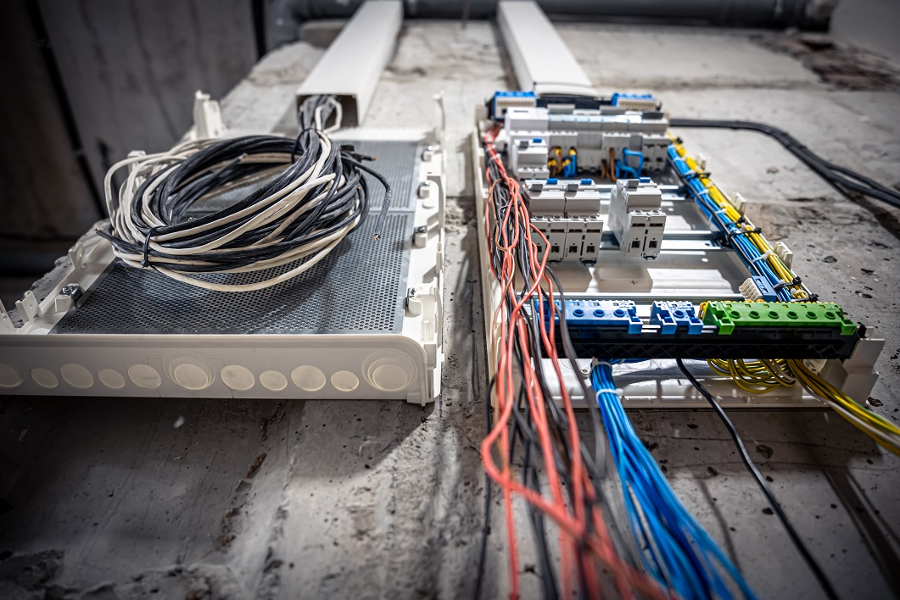

---

# 1. Проектування мережі

- `Важливість проектування`: Для правильної та ефективної роботи мережі необхідно ретельно її проектувати.

- `Стандарти: Використовуються` стандарти від IEEE, TIA (Telecommunications Industry Association), EIA (Electrical Industries Association) та інших локальних організацій.

- `Основні етапи проектування`:

    - Вибір технології (Token Ring, FDDI, Ethernet).
    - 
    - Вибір топології мережі.
    - 
    - Вибір типу кабелів та їх прокладання.
    - 
    - Розміщення мережного обладнання (пристрої 1-го, 2-го та 3-го рівнів).

# 2. Аналіз перед проектуванням

- `План будівлі`: Потрібно намалювати план будівлі, враховуючи:

    - Розмір мережі.

    - Обмеження на довжину кабелів.

    - Відповідне обладнання.

- `Точка розподілу (WC - Wiring Closet)`: Центральний пункт мережі, де збирається все обладнання.

    - `MDF (Main Distribution Facility)`: Головний розподільний пункт.

    - `IDF (Intermediate Distribution Facility)`: Проміжний розподільний пункт.

- `Зовнішнє з'єднання`: Не забути про підключення до WAN (глобальної мережі).

# 3. Норми та стандарти

- `ANSI/TIA/EIA-569-A`: Стандарт для кабельної системи та розміщення обладнання.

- `Топологія`: Розширена зірка, ієрархічна структура.

- `Кількість WC`:

    - Один WC на кожні 1000 м² поверху.

    - Якщо довжина кабелю перевищує 90 м, потрібен додатковий WC.

- `Розмір WC`: Залежить від площі, яку обслуговує.

- `Окремий WC для кожного поверху.`

# 4. Документація

- `Що включає`:

    - Технічні плани.

    - Фізична та логічна топологія.

    - Схема прокладання кабелів.

    - Таблиці для вирішення проблем.

    - Маркування розеток та кабелів.

    - Перелік розеток, кабелів, обладнання.

    - Перелік MAC- та IP-адрес.

# Вимоги до WC (Wiring Closet)

- `Безпека`: Захист від несанкціонованого доступу.

- `Розміри`: Двері повинні відчинятися назовні (ширина не менше 0,9 м).

- `Матеріали`:

   - `Стіни`: Вогнетривкі матеріали.

   - `Стеля`: Міцна, не опускається.

   - `Підлога`: Піднімається.

- `Умови в приміщенні`:

    - Освітлення: 500 люкс.

    - Температура: 21°C (опалення та вентиляція).

    - Вологість: 30-50%.

    - Електроживлення: Розетки кожні 1,8 м.

# Монтаж обладнання в WC

- `Методи монтажу`:

    - На стіни з використанням підпірок.

    - У розподільних рамках.

    - У розподільних шафах.

- `Вимоги до монтажу`:

    - Відстань від стіни: ~5 см (гіпсокартон).

    - Залишити місце для обслуговування.

    - Телефонні апарати розміщуються окремо.

# Швидкий протокол STP (Rapid Spanning Tree Protocol, RSTP)

- `Основні відмінності від STP`:

    - Об'єднання станів "blocking" та "listening" в один стан "discarding".

    - Швидше відновлення після збоїв (6 секунд порівняно з 30-50 секундами у STP).

    - Використання нових типів портів: "Alternate Port" та "Backup Port".

    - Новий формат BPDU-кадрів.

# VLAN (Віртуальні локальні мережі)

- `Основні поняття`:

    - Логічне групування користувачів (не фізичне).

    - Виконує функції маршрутизатора, але швидше.

- `Переваги VLAN`:

    - Зменшення широкомовного домену.

    - Краща масштабованість.

    - Підвищення безпеки.

    - Легка реконфігурація без зміни фізичних з'єднань.

- `Типи VLAN`:

   - `Статичний`: На основі порту (конфігурація вручну).

   - `Динамічний`: На основі MAC-адреси або IP (автоматичне призначення).

# Тегування VLAN

- `Стандарти`:

    `802.1q`: Додає 4 байти до кадру, збільшуючи максимальну довжину з 1518 до 1522 байт.

- `ISL (Cisco)`: Використовує інкапсуляцію (26 байт заголовка + 4 байти завершення). Зараз застарілий.

# Пристрої мережі

`Мости (Bridges)`:
        
    - Працюють на рівні каналу даних (MAC-адреси).

    - З'єднують мережі з різними стандартами MAC (наприклад, Ethernet та Token Ring).

`Коммутатори (Switches)`:

    - Багатопортові мости.

    - Зменшують колізійний домен.

    - Підтримують мікросергментацію (один хост на порт).

    - Використовують технологію cut-through для швидшої передачі даних.