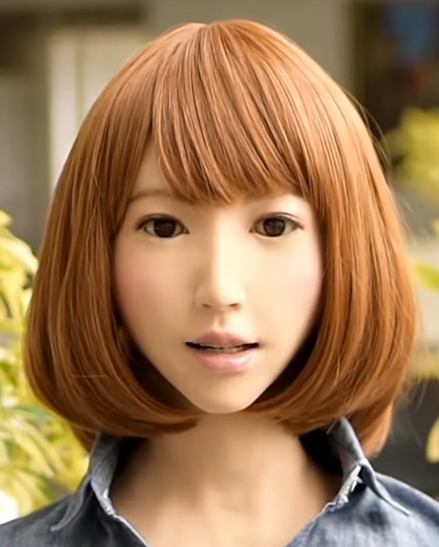

# Systemy wbudowane i internet rzeczy | System wbudowany - Embedded Systemy

Specyficzna forma wykorzystania specjalizowanego systemu komputerowego (mikroprocesorowego), do celów sterowania obiektami poprzez trwałe połączenie systemu sterowania z danym obiektem i wyposażenie go w dedykowane oprogramowanie realizujące żądane funkcje.
System wbudowany to oparty na mikroprocesorze system sprzętu komputerowego z oprogramowaniem zaprojektowanym do wykonywania dedykowanej funkcji, jako niezależny system lub jako część dużego systemu. 

---

Za pierwszy komputer wbudowany uznaje się ten, który sterował amerykańskim statkiem kosmicznym  Apollo. 
      Pierwszy komputer wbudowany produkowany masowo sterował rakietą LGM-30 Minuteman (rakietą manewrującą)

- Podstawową cechą wyróżniającą systemy wbudowane na tle innych systemów komputerowych, oprócz dedykowanego charakteru, jest jakość oprogramowania i jakość stosowanych komponentów sprzętowych.

- Kolejne cecha to ilość dostępnych kanałów wejścia wyjścia zdecydowanie większa niż w komputerach służących do przetwarzania informacji.

---

System wbudowany to system zamknięty lub wbudowany w większy.

System taki w sposób ciągły współpracuje z otoczeniem, monitorując go i realizując stosownie do informacji z tego otoczenia pewien zestaw dedykowanych funkcji (procesów).

Kolejna cecha charakterystyczna dotyczy ilości pamięci ROM i RAM. Komputery w systemach wbudowanych mają więcej pamięci ROM niż RAM. W komputerach do przetwarzania informacji jest dokładnie na odwrót. Dwa ostatnie wyjaśnienia należy wiązać z następującym ogólnym schematem systemu komputerowego.

---

Również ilość kanałów wejścia wyjścia jest różna w stosunku do systemów przetwarzania informacji. Dwa ostatnie wyjaśnienia należy wiązać z następującym ogólnym schematem systemu komputerowego.

## Cechy systemu wbudowanego (podsumowanie)

- System mikroprocesorowy
- Niezależny system lub element większej całości
- Na ogół wykonujący jedna specjalizowaną aplikacje (lub zestaw aplikacji)
- Silna integracja
- Małe rozmiary fizyczne
- Niski pobór energii ze źródła zasilania
- Wymagana wysoka niezawodność bezobsługowość i trwałość (odporność mechaniczna)
- Najczęściej brak GUI

## Komputery - podział

- Superkomputery
- Komputery  biznesowe (serwery, stacje końcowe)
- Komputery domowe (desktopowe)
- Komputery przenośne - laptopy, net-topy
- Komputery osobiste - PDA, smartfony
- Komputery do sterowania - Embedded Systems

Dobrym przykładem z którym mamy praktycznie na co dzień styczność jest automatyka samochodu która posiada wbudowanych kilkadziesiąt mikroprocesorów/mikrokontrolerów dla sterowania różnymi funkcjami pojazdu, np.:

- sterowanie układem zapłonowym oraz działaniem silnika
- sterowanie napędem
- sterowanie systemem hamowania
- sterowanie systemem bezpieczeństwa pojazdu i pasażerów

## Przykłady obszarów i urządzeń technicznych, w których stosuje się systemy wbudowane:

- układy sterujące pracą silnika samochodowego i ABS, komputery pokładowe 
- sprzęt sterujący samolotami, rakietami, pociskami rakietowymi, bomby inteligentne 
- sprzęt medyczny, w tym między innymi: monitory holterowskie
- sprzęt pomiarowy, w tym między innymi: oscyloskopy, analizatory widma 
- bankomaty i podobne urządzenia ATM 
- termostaty, klimatyzatory
- kuchenki mikrofalowe, zmywarki 
- sterowniki PLC stosowane w przemyśle do sterowania i kontroli procesów i maszyn produkcyjnych 
- sterowniki do wszelkiego rodzaju robotów mechanicznych 
- systemy alarmowe służące do ochrony osób i mienia np. antywłamaniowe, przeciwpożarowe i inne 
-  telefony komórkowe i centrale telefoniczne, 
-  drukarki, kserokopiarki
-  kalkulatory 
- sprzęt komputerowy, w tym między innymi: dyski twarde, napędy optyczne, routery, serwery i firewalle 
-  systemy rozrywki multimedialnej i interaktywnej: 
    - konsole do gier: stacjonarne i mobilne 
    - automaty np. do gier oraz inne 
    - telewizory, odtwarzacze DVD, kamery cyfrowe, magnetowidy 

    Praktycznie wszystko co kojarzy się z określeniem smart

## Inne spektakularne przykłady 

## Internet Rzeczy - IoT Internet of Things

Internet rzeczy, czyli Internet of Things (IoT), to zasadniczo ekosystem urządzeń fizycznych, pojazdów, urządzeń i innych rzeczy, które mają możliwość łączenia, gromadzenia i wymiany danych w sieci przewodowej i bezprzewodowej, z niewielką lub zerową liczbą kontaktów międzyludzkich. lub interwencja człowieka z komputerem. Umożliwiając integrację i wymianę danych między urządzeniami fizycznymi a komputerem, ta nowa fala technologii skupia się na uczynieniu ludzkiego życia prostszym i wygodniejszym dzięki odpowiedniemu połączeniu wydajności i produktywności.

W najszerszym znaczeniu termin IoT obejmuje wszystko, co jest połączone z Internetem, ale jest coraz częściej używany do definiowania obiektów, które "rozmawiają" ze sobą. "Po prostu Internet rzeczy składa się z urządzeń - od prostych czujników po smartfony i urządzenia do noszenia - połączonych ze sobą" - mówi Matthew Evans, szef programu IoT w techUK. 

Pojęcie Internet Rzeczy po raz pierwszy pojawiło się w 1999 i związane było z pracą grup badawczych pod auspicjami Massachusetts Institute of Technology (MIT). Pierwotnie dotyczyło identyfikacji obiektów z wykorzystaniem fal radiowych. Od tego czasu pojęcie Internetu Rzeczy nabrało szerszego znaczenia i obecnie określa globalną infrastrukturę teleinformatyczną w społeczeństwie korzystającym z łatwego dostępu do informacji. 

Internet rzeczy (IoT) to połączenie jednoznacznie identyfikowalnych wbudowanych urządzeń komputerowych w ramach istniejącej infrastruktury internetowej. Tak więc Internet rzeczy - IoT w zasadzie łączy wbudowane systemy z Internetem. 

Internet Rzeczy będzie później szczegółowo omawiany, na razie skupimy się na sprawach związanych z systemami wbudowanymi

## Kolejne przykłady systemów wbudowanych Humanoid

## Kolejne przykłady humanoidów eksperymentalnych

## Ten z twórcą prof. Hiroshi Ishiguro 

## Jego wnętrze

## Erica

Inny produkt Hiroshiego Ishiguro z japońskiego Uniwersytetu w Osace, który nazywa swoje dzieło „najpiękniejszym i najbardziej podobnym do człowieka androidem”.
