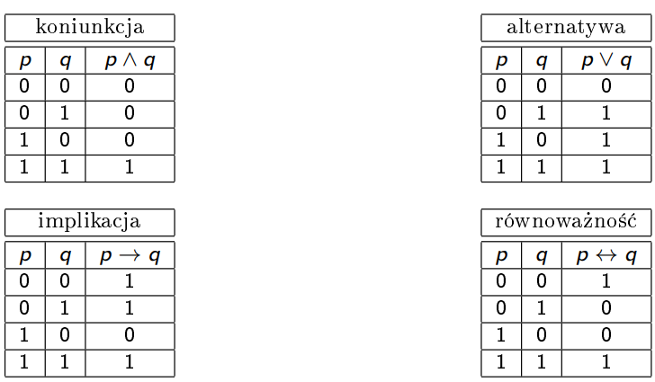
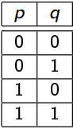
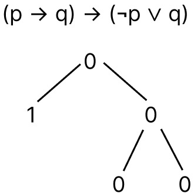
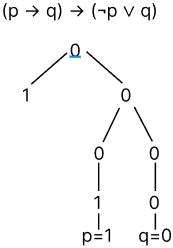
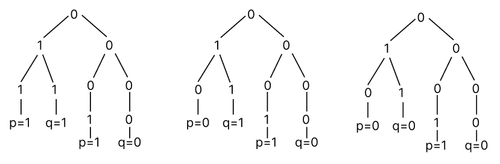
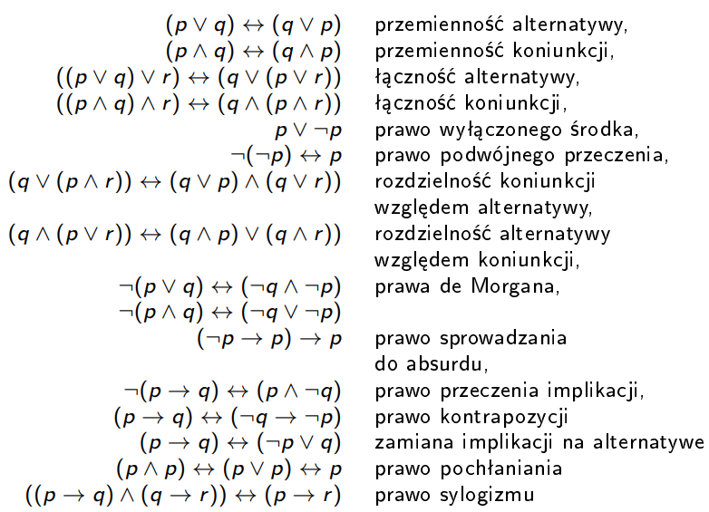

# Matematyka

## Wartościowanie

`Tautologia` - zdanie zawsze prawdziwe bez względu na kombinacje wartości logicznych zda«
składowych.

### Metody rachunku zdań

- zero-jedynkowa
- sprowadzenie do absurdu
- przekształcenia równoważne
- zamiana na arytmetykę

#### Metoda zero-jedynkowa

Przykładowy wyraz: `(p → q) → (¬p ∨ q)`

Robimy tabelkę, ze wszystkimi możliwymi wartościami zero-jedynkowymi dla wszystkich zmiennych (w naszym przypadku dla p i q, może byż więcej).

Określamy rekurencyjnie wartość wejściową każdego logicznego elementu wyrazu w oparciu o wartościach zmiennych.

We wszystkich przypadkach cały wyraz daje nam 1, więc wyraz jest tautologią.

#### Metoda sprowadzenie do absurdu

Metoda sprowadzenie do absurdu polega na założeniu, że cały wyraz jest fałszem i udowodnieniu, że to nie prawda.

Są dwa przypadka w tej metodzie:

- Udowodniliśmy, że wyraz jest fałszem, czyli znaleźliśmy takie wartości zmiennych, którzy dają nam fałsz
- Znaleźliśmy sprzeczność, to znaczy, że aby cały wyraz był fałszem, potrzebuje mieć takie wartości zmiennych w konkretnej sytuacji, ale ma inne.

Przykładowy wyraz: `(p → q) → (¬p ∨ q)`

Założymy, że wyraz jest fałszem, czyli zerem

W naszym przypadku, aby cały wyraz był zerem, po lewej stronie ma być 1, po prawej stronie ma być 0, ponieważ to implikacja.

Po obuch stronach implikacji są wyrazy. Każdy taki wyraz rozwiązujemy rekurencyjnie. Zrobimy prawą stronę, ponieważ, po lewej stronie jest implikacja i nie będziemy mogli jednoznacznie powiedzieć o wartościach p i q, ponieważ są trzy przypadka w których implikacja może być 1 i jest tylko jeden przypadek w którym alternatywa może być 0.

Alternatywa może być 0 tylko w jednym przypadku, kiedy po lewej i po prawej stronie są zera. (0 v 0 = 0)

Po lewej stronie negacja p, a po prawej stronie po prostu q, więc rekurencyjnie wyznaczamy, że p ma być 1, a q ma być 0, aby cała prawa strona głównej implikacji była zerem.

Jednoznacznie wyznaczyliśmy te wartości. Niema innych przypadków, w których mielibyśmy 0, więc p i q po lewej stronie głównej implikacji musą również zawierać 1 i 0 odpowiednie.

Ale implikacja nigdy nie daje nam 1, jeśli po lewej stronie 1, a po prawej 0. Więc mamy sprzeczność. `Znaleźliśmy sprzeczność, to znaczy że, aby cały wyraz był fałszem, potrzebuje mieć takie wartości zmiennych w konkretnej sytuacji, ale ma inne.`

#### Przekształcenia równoważne

W tej metodzie przekształcamy wyraz na tylko alternatywe i koniunkcji. Do tego używamy wzory.

Przykładowy wyraz: `(p → q) → (¬p ∨ q)`

- Cały wielki wyraz, możemy zastąpić na: `¬(p → q) ∨ (¬p ∨ q)` (_zamiana implikacji na alternatywe_)

- Te same zrobimy i z częścią `p → q`: `¬(¬p ∨ q) ∨ (¬p ∨ q)` (_zamiana implikacji na alternatywe_)

- Łączność alternatywy pozwala nam pozbyć się nawiasów w `(¬p ∨ q)` (negacja w `¬(¬p ∨ q)` nie pozwala nam tego zrobić w tej części): `¬(¬p ∨ q) ∨ ¬p ∨ q` (_łączność alternatywy_)

- Aby pozbyć się negacji w `¬(¬p ∨ q)` wykorzystujemy `prawo de Morgana`: `(p ^ ¬q) ∨ ¬p ∨ q` (_prawo de Morgana_)

- Aby pozbyć się teraz nawiasów w `(p ^ ¬q) ∨ ¬p ∨ q` wykorzystujemy `rozdzielność koniunkcji` (jako mnożenie) (np. `q` pomnożymy na `(p ^ ¬q)`): `((p ∨ q) ^ (¬q ∨ q)) ∨ ¬p` (_rozdzielność koniunkcji_)

- ... : `(p ∨ q) ∨ ¬p` (_rozdzielność koniunkcji_)

- ... : `p ∨ q ∨ ¬p` (_rozdzielność koniunkcji_)

- ... : `(p ∨ ¬p) ∨ q` (_rozdzielność koniunkcji_)

Tautologia

#### Zamiana na arytmetykę

| Wzory |        |
| ----- | ------ |
| ¬p    | 1 - p  |
| p^q   | p \* q |

Przykładowy wyraz: `(p → q) → (¬p ∨ q)`

...

## NAND, NOR

`NAND` - ¬(p^q)

`NOR` - ¬(p∨q)

...

## NAND, NOR

`NAND` - ¬(p^q)

`NOR` - ¬(p∨q)

...

## Dla wszystkich, istnieje

...

## Zbiory

...

## Grafy

`Graf` - jest to figura na płaszczyznie, która składa się z wierzchołków i krawędzi.

`Wierzchołek` - punkt, należący do figury.

`Krawędź` - linia która łączy dwa wierzchołka.

Matematycznie to zapisują tak:

**G = (V, E)**

- `G` - Graf
- `V` - zbiór wierzchołków (po ang. vertex)
- `E` - zbiór krawędzi, każda krawędź jest składana z dwóch wierzchołków (po ang. edge)

Przykład:

G = (V = {a, b, c}, E = {ab, bc, ca})

Ogólny graf nazywa się `G`, ale nie jest to wymaganym wszystkie grafy tak nazywać. Jedyna zasada - nazywać z wielkiej litery. (np. A, G1, Graf2, Map, ...)

Zapis V(G) lub E(G) wskazuje nam, że zwraca nam to zbiór wierzchołków grafa G lub zbiór krawędzi grafa G odpowiednie.

Przykłady grafów:

`Stopień (degree)` - liczba krawędzi wychodzących z (wchodzących do) wierzchołka lub liczba krawędzi grafu incydentnych do wierzchołka.

Matematyczna funkcja, która zwraca stopień wierzchołka: `deg(v)`,
gdzie v - wierzchołek.

`Cykl (cycle)` - jest to ścieżka, w której początek i koniec są tym samym.

### Graf Eulerowski

`Ścieżka Eulera` - jest to droga, jaka przechodzi przez każdą **krawędź** przynajmniej raz.

`Cykl Eulera` - jest ścieżką Eulera, w której początkowy wierzchołek jest również końcowym.

`Grafem Eulerowskim` jest graf, który zawiera `cykl Eulera`.

Przykład:

### Jak wyznaczyć czy graf jest Eulerowskim?

Każdy wierzchołek grafu ma parzysty stopień.

### Graf Hamiltona

`Ścieżka Hamiltona` - jest to droga, jaka przechodzi przez każdy **wierzchołek** przynajmniej raz.

`Cykl Eulera` - jest ścieżką Hamiltona, w której początkowy wierzchołek jest również końcowym.

`Grafem Hamiltona` jest graf, który zawiera cykl Hamiltona.

Przykład:

### Jak wyznaczyć czy graf jest Hamiltona?

Niema konkretnej zasady, aby szybko wyznaczyć czy bądź jaki graf jest Hamiltona, ale są dwa sposoby, aby większość określić.

I.

Suma stopni nie sąsiednich wierzchołków jest rowna albo większa od liczby wierzchołków podzieloną przez 2.

`p` - liczba wierzchołków, `v1` i 'v2' - nie sąsiedni wierzchołki.

Jeśli `deg(v1) + deg(v2) ≥ p / 2`, to graf jest Hamiltona.

II.

...

### Kolorowanie grafów

Kolorowanie to zastosowanie kolorów do wierzchołków tak, aby każdy wierzchołek miał inny kolor niż go sąsiad.
