# 1

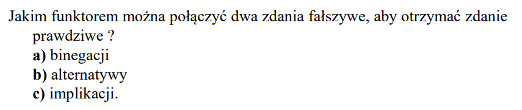

**Odpowiedź: (A)(C)**

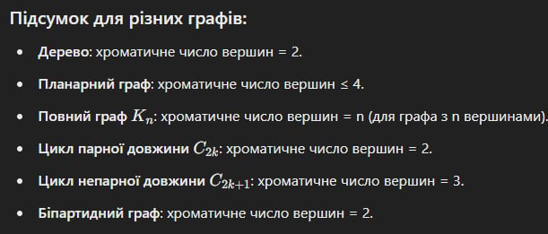

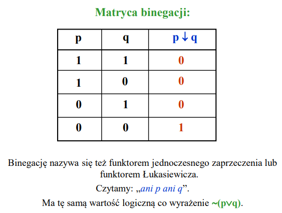

# 2

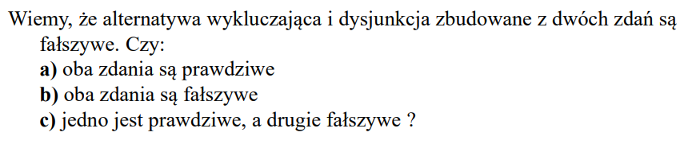

**Odpowiedź: (C)**

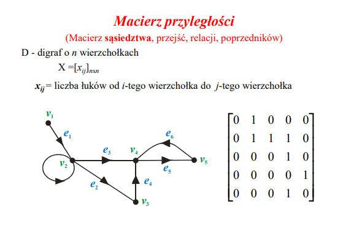

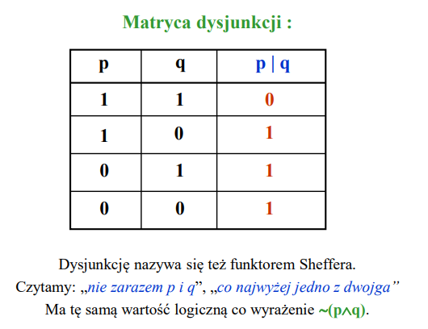

# 3

**Odpowiedź: (A)**

| p | q | p ↓ q | (p↓q)\|(p↓q) |  p v q  |
| - | - | ----- | ------------ | ------- |
| 0 | 0 |   1   |      0       |    0    |
| 1 | 0 |   0   |      1       |    1    |
| 1 | 1 |   0   |      1       |    1    |

# 4

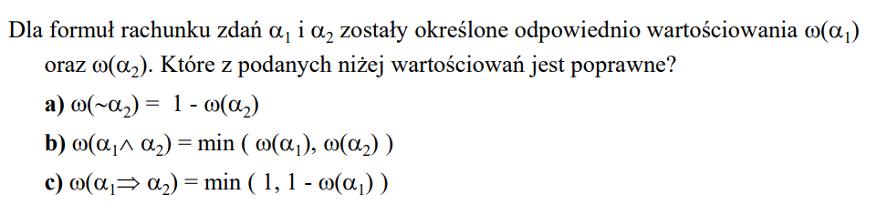
    
**Odpowiedź: (A), (B)**

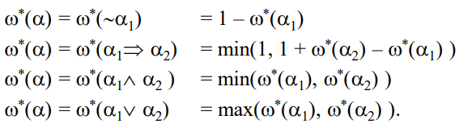

# 5

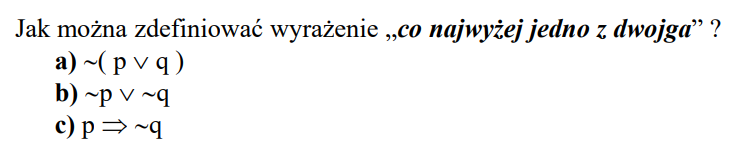

**Odpowiedź: (B)**

~(p^q) = ~p v ~q

# 6

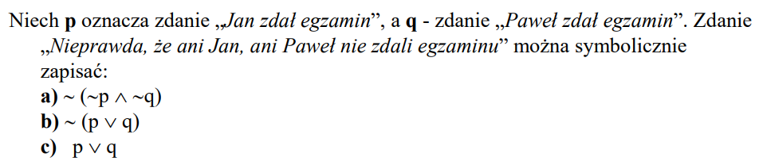

**Odpowiedź: (A)**

~(p↓q) = ~(~(p v q)) = ~(~p^~q)

# 7

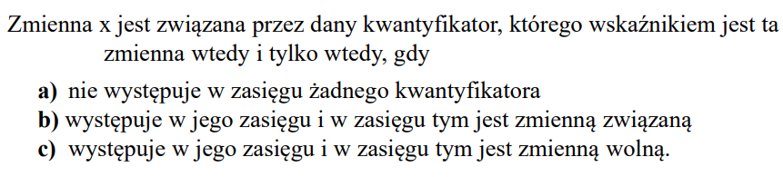

**Odpowiedź: (C)**

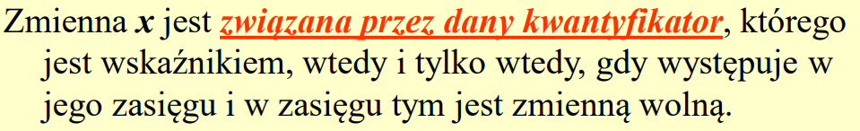

# 8

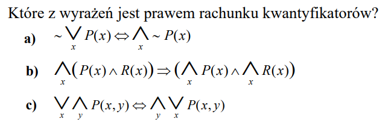

**Odpowiedź: (A)**

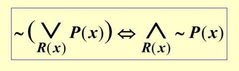

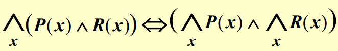

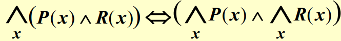

# 9

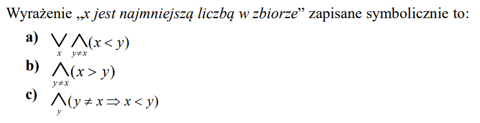

**Odpowiedź: (C)**

Mamy x jako zmienną już zdefiniowany w zadaniu, czyli wszystkie odpowiedzi, w ktorych opisujemy x już są nie poprawne i pozostaje tylko jedne, w którym opisujemy y i jeśli y nie jest x, to y > x.

# 10

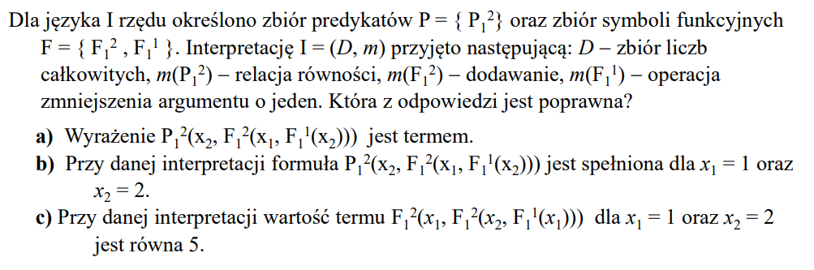

**Odpowiedź: (B)**

a) Terminem nazywa się zmienna, constanta lub funkcja zastosowana do innych terminów. P jest predykatem, który formuję wzór, który może być fałszem lub prawdą.

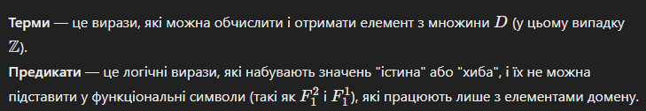

# 11

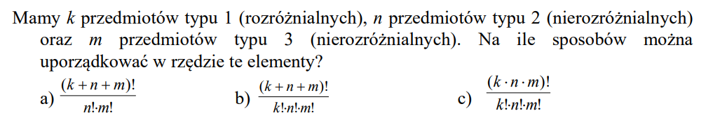

**Odpowiedź: (B)?**

# 12

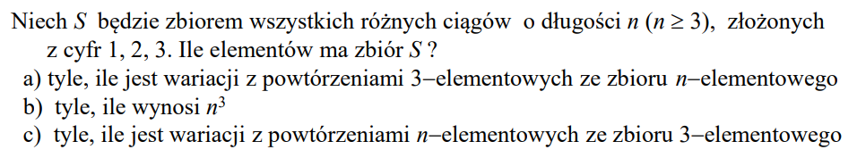

**Odpowiedź: (B)**

Ciąg złożony z 1, 2, 3;

n\*n\*n = n^3

# 13

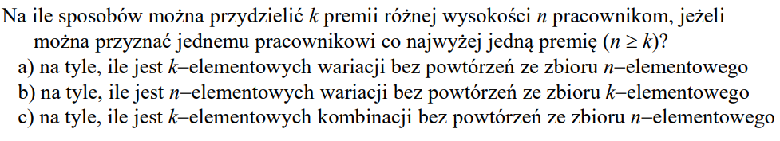

**Odpowiedź: (A)**

Kombinacja - kiedy porządek ne jest potrzebny. [C]
Wariacja - kiedy porządek jest potrzebny. [A]

# 14

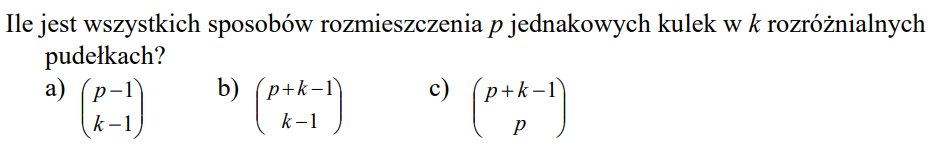

**Odpowiedź: (C)**

Jest to klasyczna kombinacja z powtórzeniami. Problem związany w tym, że mamy p jednakowych kulek і k rozróżnialnych pudełek, czyli musimy podzielić p elementów na k grup.

Wyobrazimy sobie ● - jako kulki, a | - jako separatory, które reprezentują pudełki -> ( | | ) - puste miejsca i są pudełki. Kresek zawsze mniejsze na 1 niż pudełek.

●●|●●|● - taki zapis oznacza 5 kulek i 3 pudełka.

●●●●●|| - w pierwszym pudełku 5 kulek, a w pozostałych dwoch 0

I takim sposobem potrzebujemy tylko wybrać 5 kulek z 7 elementów.

( p + k - 1 ) - Odpowiedź
(     p     )

● ● ● ● ● | |
^ ^   ^   ^ ^
| |   |   | |

      |
      v
●●●|| - 3 w pierwszym pudełku, a wszystkie pozostałe są puste.

# 15

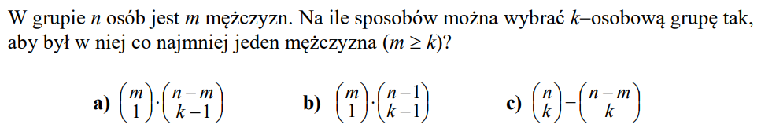

**Odpowiedź: (B)?**

Najpierw wybieramy mężczyznę i do niego wybieramy wybieramy z

# 16

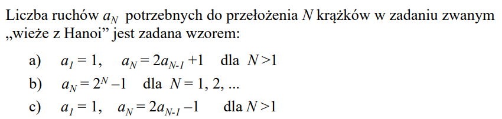

**Odpowiedź: ?**

# 17

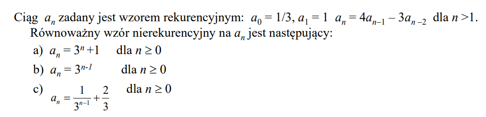

**Odpowiedź: (B)**

Podstawimy n = 1, n = 0 we wszystkie wzory. Musimy otrzymać wartość a0, a1. Gdy znajdziemy taki wzór, jest to nasz szukany wzór

# 18

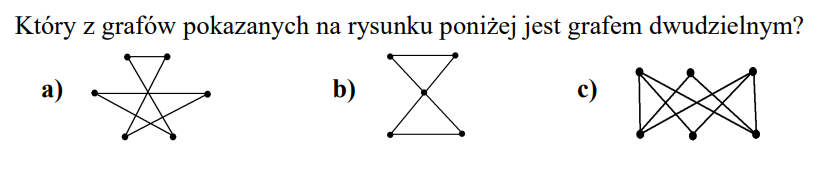

**Odpowiedź: (C)**

Graf dwudzielny jest grafem, którego wierzchołki były rozdzielone na dwa zbiora i każdy wierzchołek był połączony z wierzchołkiem innego zbioru.

# 19

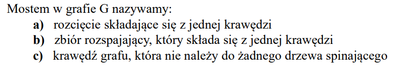

**Odpowiedź: (A)**

# 20

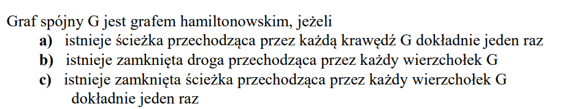

**Odpowiedź: (B)**

# 21

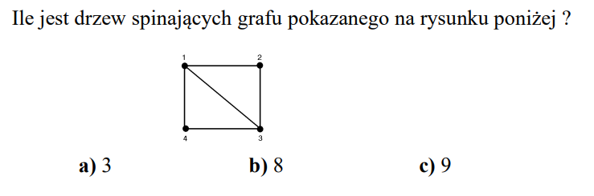

**Odpowiedź: (B)?**

# 22

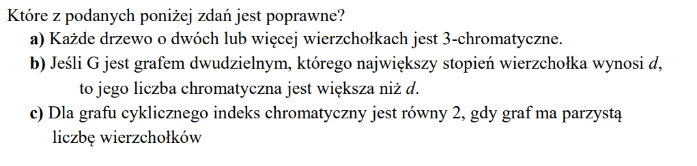

**Odpowiedź: (C)**

# 23

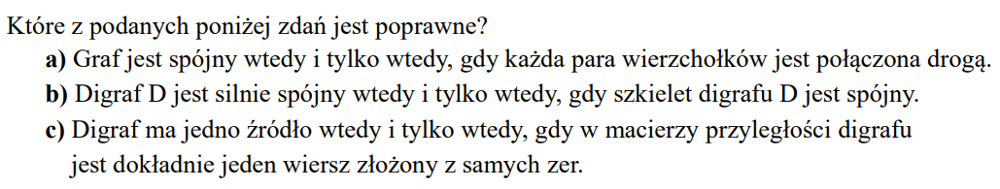

**Odpowiedź: (A), (B)?**