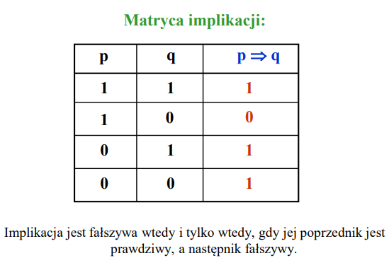
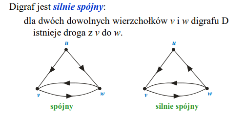
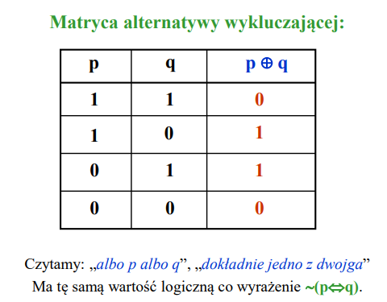

# 1

**Odpowiedź: (A)(C)**

# 2

**Odpowiedź: (C)**

# 3

**Odpowiedź: (A)**

| p | q | p ↓ q | (p↓q)\|(p↓q) |  p v q  |
| - | - | ----- | ------------ | ------- |
| 0 | 0 |   1   |      0       |    0    |
| 1 | 0 |   0   |      1       |    1    |
| 1 | 1 |   0   |      1       |    1    |

# 4

    
**Odpowiedź: (A), (B)**

# 5

**Odpowiedź: (B)**

~(p^q) = ~p v ~q

# 6

**Odpowiedź: (A)**

~(p↓q) = ~(~(p v q)) = ~(~p^~q)

# 7

**Odpowiedź: (C)**

# 8

**Odpowiedź: (A)**

# 9

**Odpowiedź: (C)**

Mamy x jako zmienną już zdefiniowany w zadaniu, czyli wszystkie odpowiedzi, w ktorych opisujemy x już są nie poprawne i pozostaje tylko jedne, w którym opisujemy y i jeśli y nie jest x, to y > x.

# 10

**Odpowiedź: (B)**

a) Terminem nazywa się zmienna, constanta lub funkcja zastosowana do innych terminów. P jest predykatem, który formuję wzór, który może być fałszem lub prawdą.

# 11

**Odpowiedź: (B)?**

# 12

**Odpowiedź: (A)?**

Ciąg złożony z 1, 2, 3;

n\*n\*n = n^3

# 13

**Odpowiedź: (A)**

Kombinacja - kiedy porządek ne jest potrzebny. [C]
Wariacja - kiedy porządek jest potrzebny. [A]

W naszym przypadku to [A], ponieważ mamy gradację premii. Gdyby było po prostu premia bez różnej wysokości, było by [C].

# 14

**Odpowiedź: (C)**

Jest to klasyczna kombinacja z powtórzeniami. Problem związany w tym, że mamy p jednakowych kulek і k rozróżnialnych pudełek, czyli musimy podzielić p elementów na k grup.

Wyobrazimy sobie ● - jako kulki, a | - jako separatory, które reprezentują pudełki -> ( | | ) - puste miejsca i są pudełki. Kresek zawsze mniejsze na 1 niż pudełek.

●●|●●|● - taki zapis oznacza 5 kulek i 3 pudełka.

●●●●●|| - w pierwszym pudełku 5 kulek, a w pozostałych dwoch 0

I takim sposobem potrzebujemy tylko wybrać 5 kulek z 7 elementów.

( p + k - 1 ) - Odpowiedź
(     p     )

      ● ● ● ● ● | |
      ^ ^   ^   ^ ^
      | |   |   | |
      1 2   3   4 5 - kolejność ważna
            |
            v
●●●|| - 3 w pierwszym pudełku, a wszystkie pozostałe są puste.

# 15

**Odpowiedź: (B)(C)**

# 16

**Odpowiedź: ?**

# 17

**Odpowiedź: (B)**

Podstawimy n = 1, n = 0 we wszystkie wzory. Po podstawieniu musimy otrzymać wartość a0, a1. Gdy znajdziemy taki wzór, jest to nasz szukany wzór.

# 18

**Odpowiedź: (C)**

Graf dwudzielny jest grafem, którego wierzchołki były rozdzielone na dwa zbiora i każdy wierzchołek był połączony z wierzchołkiem innego zbioru.

# 19

**Odpowiedź: (A)**

# 20

**Odpowiedź: (B)**

# 21

**Odpowiedź: (B)**

      [0 1 1 1]
      [1 0 1 0]
      [1 1 0 1] = A - macierz sąsiedztwa
      [1 0 1 0]

      [3 0 0 0]
      [0 2 0 0]
      [0 0 3 0] = D - macierz stopni wierzchołków
      [0 0 0 2]

      [3 -1 -1 -1]
      [-1 2 -1  0]
      [-1 -1 3 -1] = (D-A) - Macierz Laplace'a 𝐿
      [-1 0 -1  2]

      [2 -1  0]
      [-1 3 -1] = M
      [0 -1  2]

      2[3 -1] - (-1)[-1 -1] + 0[-1 3]
      [-1 2]       [0   2]    [0 -1] = det(M) = 8

      2(3*2 - (-1\*-1)) + (-1\*2 - 0\*(-1)) + 0 =
      = 2 * 5 - 2 = 8
           

# 22

**Odpowiedź: (C)**

# 23

**Odpowiedź: (A)**

