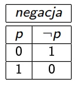

# Wartościowanie

`Tautologia` - zdanie zawsze prawdziwe bez względu na kombinacje wartości logicznych zda«
składowych.

## Wartościowanie słowami 

| Znak | Wartość |
| ---- | ------- |
| a → b  | Jeśli a, to b |
| a ^ b  | i a, i b |
| a ∨ b  | abo a, abo b |
| a <=> b  | Jeśli a i tylko a, to b |
| ¬a  | nie a |

## Metody rachunku zdań

- zero-jedynkowa
- sprowadzenie do absurdu
- przekształcenia równoważne
- zamiana na arytmetykę

### Metoda zero-jedynkowa

Przykładowy wyraz: `(p → q) → (¬p ∨ q)`

Robimy tabelkę, ze wszystkimi możliwymi wartościami zero-jedynkowymi dla wszystkich zmiennych (w naszym przypadku dla p i q, może byż więcej).

Określamy rekurencyjnie wartość wejściową każdego logicznego elementu wyrazu w oparciu o wartościach zmiennych.

We wszystkich przypadkach cały wyraz daje nam 1, więc wyraz jest tautologią.

### Metoda sprowadzenie do absurdu

Metoda sprowadzenie do absurdu polega na założeniu, że cały wyraz jest fałszem i udowodnieniu, że to nie prawda.

Są dwa przypadka w tej metodzie:

- Udowodniliśmy, że wyraz jest fałszem, czyli znaleźliśmy takie wartości zmiennych, którzy dają nam fałsz
- Znaleźliśmy sprzeczność, to znaczy, że aby cały wyraz był fałszem, potrzebuje mieć takie wartości zmiennych w konkretnej sytuacji, ale ma inne.

Przykładowy wyraz: `(p → q) → (¬p ∨ q)`

Założymy, że wyraz jest fałszem, czyli zerem

W naszym przypadku, aby cały wyraz był zerem, po lewej stronie ma być 1, po prawej stronie ma być 0, ponieważ to implikacja.

Po obuch stronach implikacji są wyrazy. Każdy taki wyraz rozwiązujemy rekurencyjnie. Zrobimy prawą stronę, ponieważ, po lewej stronie jest implikacja i nie będziemy mogli jednoznacznie powiedzieć o wartościach p i q, ponieważ są trzy przypadka w których implikacja może być 1 i jest tylko jeden przypadek w którym alternatywa może być 0.

Alternatywa może być 0 tylko w jednym przypadku, kiedy po lewej i po prawej stronie są zera. (0 v 0 = 0)

Po lewej stronie negacja p, a po prawej stronie po prostu q, więc rekurencyjnie wyznaczamy, że p ma być 1, a q ma być 0, aby cała prawa strona głównej implikacji była zerem.

Jednoznacznie wyznaczyliśmy te wartości. Niema innych przypadków, w których mielibyśmy 0, więc p i q po lewej stronie głównej implikacji musą również zawierać 1 i 0 odpowiednie.

Ale implikacja nigdy nie daje nam 1, jeśli po lewej stronie 1, a po prawej 0. Więc mamy sprzeczność. `Znaleźliśmy sprzeczność, to znaczy że, aby cały wyraz był fałszem, potrzebuje mieć takie wartości zmiennych w konkretnej sytuacji, ale ma inne.`

### Przekształcenia równoważne

W tej metodzie przekształcamy wyraz na tylko alternatywe i koniunkcji. Do tego używamy wzory.

    !!Uwaga!!
    ¬p ∨ p = 1 - zawsze

Przykładowy wyraz: `(p → q) → (¬p ∨ q)`

- Cały wielki wyraz, możemy zastąpić na: `¬(p → q) ∨ (¬p ∨ q)` (_zamiana implikacji na alternatywe_)

- Te same zrobimy i z częścią `p → q`: `¬(¬p ∨ q) ∨ (¬p ∨ q)` (_zamiana implikacji na alternatywe_)

- Łączność alternatywy pozwala nam pozbyć się nawiasów w `(¬p ∨ q)` (negacja w `¬(¬p ∨ q)` nie pozwala nam tego zrobić w tej części): `¬(¬p ∨ q) ∨ ¬p ∨ q` (_łączność alternatywy_)

- Aby pozbyć się negacji w `¬(¬p ∨ q)` wykorzystujemy `prawo de Morgana`: `(p ^ ¬q) ∨ ¬p ∨ q` (_prawo de Morgana_)

- Aby pozbyć się teraz nawiasów w `(p ^ ¬q) ∨ ¬p ∨ q` wykorzystujemy `rozdzielność koniunkcji` (jako mnożenie) (np. `q` pomnożymy na `(p ^ ¬q)`): `((p ∨ q) ^ (¬q ∨ q)) ∨ ¬p` (_rozdzielność koniunkcji_)

- Opuszczamy nawiasy: `(p ∨ q) ∨ ¬p` (_rozdzielność koniunkcji_)

- Przekształcmy wyraz tak, aby zrozumieć czy może on mieć jedynkę: `(p ∨ ¬p) ∨ q` (_rozdzielność koniunkcji_)

`(p ∨ ¬p)` - zawsze będzie jedynką, co daje dam możliwość stwierdzić, żę `(p ∨ ¬p) ∨ q` też będzie zawszę jedynką, ponieważ alternatywa musi mieć tylko jeden argument 1, aby cały wyraz miał 1. Więc to jest tautologia.

#### Zamiana na arytmetykę

    p <=> q = (p → q) ^ (q → p)

Przykładowy wyraz: `(p → q) → (¬p ∨ q)`

Ten wyraz można rozwiązać różnymi sposobami. Preferuję rozbić go na małe części, rozwiązać ich, potem skombinować te małe części, i powtarzać tak do końca.

Założymy że `(p → q)` - `a`,
a `(¬p ∨ q)` - `b`

    a) p → q = 1 - p + pq;
    b) ¬p ∨ q = (1 - p) ∨ q = (1 - p) + q - (1 - p) * q;
    ab) a → b = 1 - (1 - p + pq) + (1 - p + pq)(1 - p + pq) =
    = 1 - 1 + p - pq + (1 - p + pq - p + p^2 - (p^2)*q + pq - (p^2)*q + (p^2)*q + (p^2)*(q^2)) =
    = p - pq + 1 - p + pq - p + p - pq + pq - pq + pq + pq = 1

Otrzymaliśmy `1`, co znaczy jest to tautologia.