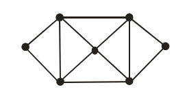

# Grafy

`Graf` - jest to figura na płaszczyznie, która składa się z wierzchołków i krawędzi.

`Wierzchołek` - punkt, należący do figury.

`Krawędź` - linia która łączy dwa wierzchołka.

`Stopień (degree)` - liczba krawędzi wychodzących z (wchodzących do) wierzchołka lub liczba krawędzi grafu incydentnych do wierzchołka.

Matematyczna funkcja, która zwraca stopień wierzchołka: `deg(v)`,
gdzie v - wierzchołek.

`Cykl (cycle)` - jest to ścieżka, w której początek i koniec są tym samym.

Matematycznie to zapisują tak:

**G = (V, E)**

- `G` - Graf
- `V` - zbiór wierzchołków (po ang. vertex)
- `E` - zbiór krawędzi, każda krawędź jest składana z dwóch wierzchołków (po ang. edge)

Przykład:

G = (V = {a, b, c}, E = {ab, bc, ca})

Ogólny graf nazywa się `G`, ale nie jest to wymaganym wszystkie grafy tak nazywać. Jedyna zasada - nazywać z wielkiej litery. (np. A, G1, Graf2, Map, ...)

Zapis `V(G)` lub `E(G)` wskazuje nam, że zwraca nam to zbiór *wierzchołków* grafa G lub zbiór *krawędzi* grafa G odpowiednie.

`V(G)` - niepusty, skończony zbiór elementów zwanych wierzchołkami
(węzłami, punktami)

`E(G)` - skończony zbiór nieuporządkowanych par elementów zbioru V(G)
zwanych krawędziami.

## Teoria

Dwa `wierzchołki` grafu są `sąsiednie`, jeżeli istnieje krawędź łącząca je.

Wierzchołki są wówczas `incydentne` z tą krawędzią.

Dwie `krawędzie` grafu są `sąsiednie`, jeżeli mają przynajmniej jeden
wspólny wierzchołek.

`Stopień wierzchołka` - liczba krawędzi incydentnych z tym
wierzchołkiem.

> Licząc stopień wierzchołka przyjmujemy, że każda pętla jest liczona dwa razy.

`izolowany` - wierzchołek stopnia zero.

`końcowy` (wiszący)` - wierzchołek stopnia jeden.

...

## Typy Grafów

`Graf ogólny` - to graf, w którym występują pętli (krawędzi łączących wierzchołki same ze sobą) oraz
krawędzi wielokrotnych.

`Graf prosty` - graf, który nie zawiera pętel i krawędzi wielokrotnych.

> Każdy graf prosty jest grafem ogólnym, ale nie każdy graf ogólny jest
grafem prostym.

## Graf Eulerowski

`Ścieżka Eulera` - jest to droga, jaka przechodzi przez każdą **krawędź** przynajmniej raz.

`Cykl Eulera` - jest ścieżką Eulera, w której początkowy wierzchołek jest również końcowym.

`Grafem Eulerowskim` jest graf, który zawiera `cykl Eulera`.

Przykład:

opis...

### Graf pół Eulerowski

...

### Jak wyznaczyć czy graf jest Eulerowskim?

- Każdy wierzchołek grafu ma parzysty stopień.

- Graf spójny G jest grafemeulerowskimwtedy i tylko wtedy, gdy stopień każdego wierzchołka grafu G jest
liczbą parzystą.

Przykład:

...

## Graf Hamiltona

`Ścieżka Hamiltona` - jest to droga, jaka przechodzi przez każdy **wierzchołek** przynajmniej raz.

`Cykl Eulera` - jest ścieżką Hamiltona, w której początkowy wierzchołek jest również końcowym.

`Grafem Hamiltona` jest graf, który zawiera cykl Hamiltona.

Przykład:

opis...

### Graf pół Hamiltona

...

### Jak wyznaczyć czy graf jest Hamiltona?

Dla grafów hamiltonowskich nie ma udowodnionych warunkówkoniecznych i wystarczających takich, jak w przypadku grafóweulerowskich.

I.

Suma stopni nie sąsiednich wierzchołków jest rowna albo większa od liczby wierzchołków podzieloną przez 2.

`p` - liczba wierzchołków, `v1` i `v2` - nie sąsiedni wierzchołki.

Jeśli `deg(v1) + deg(v2) ≥ p / 2`, to graf jest Hamiltona.

Przykład:

...

opis...

II.

...

## Najkrotsza droga, drzewa

### Algorytm Prima

...

### Algorytm Borůvka

...

### Algorytm Kruskala

...

### Algorytm Dijkstry

...

## Kolorowanie grafów

### Kolorowanie wierzchołków

Kolorowanie to zastosowanie kolorów do wierzchołków tak, aby każdy wierzchołek miał inny kolor niż go sąsiad.

...

### Kolorowanie krawędzi

...