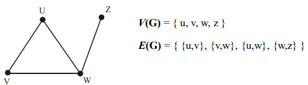

# Grafy

`Graf` - figura na płaszczyźnie, która składa się z wierzchołków i krawędzi.

`Wierzchołek` - punkt należący do figury.

`Krawędź` - linia, która łączy dwa wierzchołki.

`Stopień (degree)` - liczba krawędzi wychodzących z (lub wchodzących do) wierzchołka albo liczba krawędzi grafu incydentnych do wierzchołka.

Matematyczna funkcja, która zwraca stopień wierzchołka: `deg(v)`,  
gdzie `v` - wierzchołek.

`Cykl (cycle)` - ścieżka, w której początek i koniec są tym samym.

Matematycznie zapisujemy to tak:

**G = (V, E)**

- `G` - graf  
- `V` - zbiór wierzchołków (ang. vertex)  
- `E` - zbiór krawędzi, każda krawędź składa się z dwóch wierzchołków (ang. edge)

Przykład:

    G = (V = {a, b, c}, E = {ab, bc, ca})


Ogólny graf nazywa się `G`, ale nie jest to wymagane. Jedyna zasada to nazewnictwo z wielkiej litery (np. `A`, `G1`, `Graf2`, `Map`).

Zapis `V(G)` lub `E(G)` wskazuje nam, że zwraca nam to zbiór *wierzchołków* grafa G lub zbiór *krawędzi* grafa G odpowiednie.

- `V(G)` - niepusty, skończony zbiór elementów zwanych wierzchołkami (węzłami, punktami).
- `E(G)` - skończony zbiór nieuporządkowanych par elementów zbioru `V(G)` zwanych krawędziami.

## Teoria

Dwa `wierzchołki` grafu są `sąsiednie`, jeżeli istnieje krawędź łącząca je.  
Wierzchołki są wówczas `incydentne` z tą krawędzią.  

Dwie `krawędzie` grafu są `sąsiednie`, jeżeli mają przynajmniej jeden wspólny wierzchołek.  

`Stopień wierzchołka` - liczba krawędzi incydentnych z tym wierzchołkiem.

> Licząc stopień wierzchołka, przyjmujemy, że każda pętla jest liczona dwa razy.

- `Izolowany` - wierzchołek stopnia zero.  
- `Końcowy` (wiszący) - wierzchołek stopnia jeden.


---

## Typy Grafów

### Graf ogólny
`Graf ogólny` - graf, w którym występują pętle (krawędzie łączące wierzchołki same ze sobą) oraz krawędzie wielokrotne.


### Graf prosty
`Graf prosty` - graf, który nie zawiera pętli i krawędzi wielokrotnych.

> Każdy graf prosty jest grafem ogólnym, ale nie każdy graf ogólny jest grafem prostym.



---

## Graf pełny

`Graf pełny` - graf prosty, nieskierowany, w którym dla każdej pary węzłów istnieje krawędź je łącząca.

## Graf Eulerowski

`Ścieżka Eulera` - droga, która przechodzi przez każdą **krawędź** przynajmniej raz.

`Cykl Eulera` - ścieżka Eulera, w której początkowy wierzchołek jest również końcowym.

`Grafem Eulerowskim` jest graf, który zawiera `cykl Eulera`.

Przykład:


Cykl Eulera:

    3 ➡ 1 ➡ 0 ➡ 3 ➡ 2 ➡ 4 ➡ 3

Po takim krawędziom przerzedliśmy:

    B ➡ A ➡ F ➡ C ➡ D ➡ E

### Jak wyznaczyć czy graf jest Eulerowskim?

- Graf jest spójnym (ignorujemy wierzchołki izolowane, szczególny przypadek)

- Każdy wierzchołek `v` grafu `G` ma parzysty stopień.

```latex
∀v∈V(G)(deg(v)mod2=0)
```

Przykład:


Niebieskim kolorom są napisane stopni wierzchołków.

1) Graf jest spójnym (możemy dojść do każdego wierzchołku).
2) Wszystkie stopni mają liczbę parzystą.

## Graf pół Eulerowski

`Grafem pół eulerowskim` nazywa się graf, który zawiera tylko ścieżkę Eulera (czyli nie zawiera cyklu Eulera)

Przykład:


### Jak wyznaczyć czy graf jest Eulerowskim?

- Graf jest spójnym (ignorujemy wierzchołki izolowane, szczególny przypadek)

- Tylko dwa wierzchołka mają liczbę nie parzystą. (wszystkie pozostałe mają liczbę parzystą).

Przykład:


Niebieskim kolorom są napisane parzystych stopni wierzchołków. Czerwony nie parzyste.

1) Graf jest spójnym (możemy dojść do każdego wierzchołku).
2) Wszystkie stopni mają liczbę parzystą (oprócz dwóch `0`i `2`).

## Graf Hamiltona

`Ścieżka Hamiltona` - jest to droga, jaka przechodzi przez każdy **wierzchołek** przynajmniej raz.

`Cykl Eulera` - jest ścieżką Hamiltona, w której początkowy wierzchołek jest również końcowym.

`Grafem Hamiltona` jest graf, który zawiera cykl Hamiltona.

Przykład:


Cykl Hamiltona: 

    a ➡ b ➡ c ➡ d ➡ e ➡ a

### Jak wyznaczyć czy graf jest Hamiltonowski?

> Dla grafów hamiltonowskich nie ma udowodnionych warunków koniecznych i wystarczających takich, jak w przypadku grafów eulerowskich.   

**I. Twierdzenie Diraca**

Jeśli w grafie prostym `𝐺=(𝑉,𝐸)` o `n` wierzchołkach **(n≥3)**, każdy wierzchołek ma stopień co najmniej **n/2**, to graf jest Hamiltonowski.

    Jeśli: ∀v∈V(G)(deg(v) ≥ n / 2) ⟹ graf `G` jest Hamiltonowski.

Przykład:


n = 6, liczba wierzchołków

> Graf ma liczbę wierzchołków ≥ 3

- deg(a) - 3
- deg(b) - 3
- deg(c) - 3
- deg(d) - 3
- deg(e) - 3
- deg(f) - 3

```
6 / 2 = 3

Stopień każdego wierzchołku jest ≥ od 3, czyli graf jest Hamiltonoski
```

**II. Twierdzenie Ore'a**

Jeśli dla dowolnych dwóch wierzchołków niepołączonych krawędzią ***u, v*** suma ich stopni spełnia **deg(u) + deg(v) ≥ n**, to graf jest Hamiltonowski.

    ∀u,v∈V(G),{u,v} nie należy do E(G)(deg(u)+deg(v)≥n) ⟹ graf jest Hamiltonowski.

Przykład:


n = 6, liczba wierzchołków

- deg(a) - 3
- deg(b) - 3
- deg(c) - 3
- deg(d) - 3
- deg(e) - 3
- deg(f) - 3

```
deg(a) + deg(e) ≥ n, czyli graf jest Hamiltonowski
```

> Uwagi!

- Brak spełnienia warunków **Diraca** lub **Ore'a** nie   oznacza, że graf nie jest Hamiltonowski.
- Sprawdzanie Hamiltonowskości w praktyce najczęściej wymaga **heurystyk** lub **algorytmów specyficznych** dla danego problemu/grafu.

## Najkrotsza droga, drzewa

### Algorytm Prima

...

### Algorytm Borůvka

...

### Algorytm Kruskala

...

### Algorytm Dijkstry

...

## Kolorowanie grafów

### Kolorowanie wierzchołków

Kolorowanie to zastosowanie kolorów do wierzchołków tak, aby każdy wierzchołek miał inny kolor niż go sąsiad.

Przykład:


#### Teoria 

!!! Postaram się wszystko przepisać !!!

Graf jest `k-kolorowalny` (wierzchołkowo), jeśli każdemu wierzchołkowi możemy przypisać jeden z k kolorów tak, że żadne dwa wierzchołki sąsiednie nie mają tego samego koloru.

Jeśli G jest `k-kolorowalny`, ale nie jest `(k-1)-kolorowalny` to mówimy, że graf jest k-chromatyczny.

`Liczbą chromatyczną grafu X(G)` nazywamy najmniejszą liczbę kolorów niezbędną do właściwego pokolorowania wierzchołków grafu.

KAŻDY PLANARNY GRAF PROSTY JEST 4-KOLOROWALNY.

Jeśli G jest grafem prostym, w którym największy stopień
wierzchołka wynosi d, to graf G jest (d+1)-kolorowalny.`X(G) <= d+1` górne ograniczenie liczby chromatycznej.

Jeśli G jest spójnym grafem prostym, nie będącym grafem
pełnym i jeśli największy stopień wierzchołka grafu G
wynosi d (d >= 3), to graf G jest d-kolorowalny
`X(G) <= d`

### Czy pewne grafy mogą być pokolorowane za pomocą danej liczby kolorów?

### Jaka jest najmniejsza liczba kolorów potrzebna do pokolorowania grafu?

### Na ile sposobów można dany graf pokolorować przy użyciu zadanej liczby kolorów?

### Kolorowanie krawędzi

Graf G jest k-barwny krawędziowo (k-barwny(e)), gdy jego
krawędzie można tak pokolorować k barwami, aby żadne
dwie krawędzie sąsiednie nie miały tego samego koloru.

Gdy graf G jest k-barwny(e), lecz nie jest (k-1)-barwny(e), to
jego liczba chromatyczna krawędziowa - indeks
chromatyczny (G) - wynosi k.

Jeśli G jest grafem prostym, którego największy stopień
wierzchołka wynosi d, to d <= X'(G) <= d+1.

Dokładne określenie, które grafy mają (G)=d, a które (G)= d+1, jest
problemem.
Np. (Cn
) = 2, gdy n jest parzyste lub (Cn
) = 3, gdy n jest nieparzyste.
Np. (Kn
) = n, gdy n jest nieparzyste, (Kn
) = n-1, gdy n jest parzyste.

Jeśli G jest grafem dwudzielnym z maksymalnym stopniem
wierzchołka d, to (G) = d.


Mapa jest k-kolorowalna (f), jeśli jej ściany można
pokolorować k kolorami tak, by żadne dwie ściany
ograniczone wspólną krawędzią nie były pomalowane tym
samym kolorem.

Niech G będzie grafem planarnym bez pętli i niech G* będzie grafemgeometrycznie dualnym do grafu G.
Graf G jest kkolorowalny(v) wtedy i tylko wtedy, gdy graf G* jest
kkolorowalny(f).

    Dla dowolnego twierdzenia dotyczącego kolorowania wierzchołków grafu planarnego możemy utworzyć twierdzenie dualne mówiące o kolorowaniu ścian mapy

Krawędzie e1, e2 grafu nazywamy niezależnymi, jeśli nie są incydentne ze wspólnym wierzchołkiem. Skojarzeniem w grafie nazywamy dowolny podzbiór krawędzi parami niezależnych. 