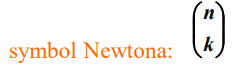

# Kombinatoryka

## Silnia

Określa liczbę wszystkich ustawień albo uporządkowań, albo
`PERMUTACJI` n przedmiotów.

PERMUTACJA - ang. permutation, укр. перестановка

`n! = n * (n - 1)!`

`n! = n * (n - 1) * (n - 2) ... 2 * 1`;

`1! = 1;` - jeden element można przekształcić tylko jeden raz

`0! = 1;` - zero elementów można przekształcić tylko jeden raz

    Ile słów można utworzyć z liter A K R używając każdej z nich tylko jeden raz?

    3! = 6;    
    3 * 2 * 1 = 6;

Permutacją bez powtórzeń `n` elementów nazywamy ciąg składający się z `n` elementów uporządkowanych i różnych.

Liczba możliwych permutacji zbioru n-elementowego:

## Liczba wariacji bez powtórzeń

## Liczba wariacji z powtórzeniami

## Kombinacją bez powtórzeń k-elementową ze zbioru n elementów

Liczba k-elementowych kombinacji bez powtórzeń
ze zbioru n elementów:

